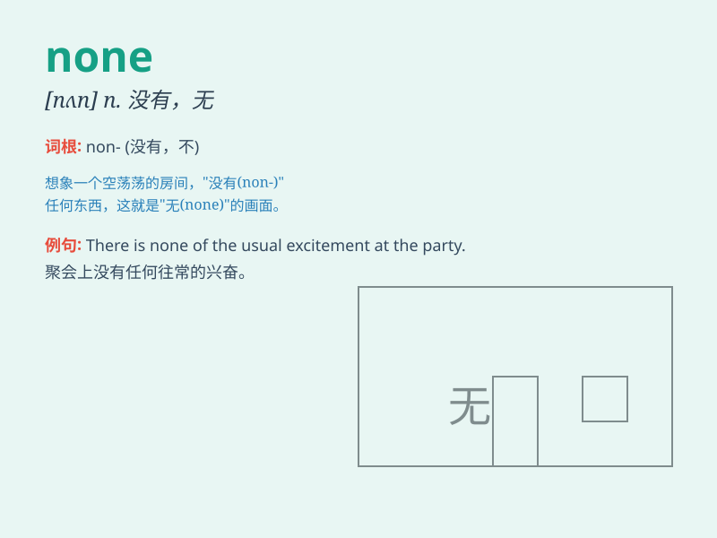

## none

**英音:** _[nʌn]_ **美音:** _[nʌn]_

**译义:** *adv.决不,毫不 pron.一个也没有,毫无*

### 短语

+ **none of:** _（三个或以上）都不；没有一个_

+ **none other than:** _不是别人而正是_

+ **have none of:** _不接受；拒绝_

+ **none the less:** _仍然；还是_

+ **none too:** _一点也不_

### 例句

#### 例句1

> **None of the students passed the exam.**

**中文翻译:** 没有一个学生通过考试。

**单词释义:** 没有一个

#### 例句2

> **He invited many people, but none came.**

**中文翻译:** 他邀请了很多人，但没有人来。

**单词释义:** 一个都不

#### 例句3

> **I wanted some apples, but there were none left.**

**中文翻译:** 我想要一些苹果，但是没有了。

**单词释义:** 一个都没有

### 背诵小故事

> 曾经有一群人在分苹果，一个接一个地拿，最后发现没有剩下的了，这就是
none，一个都没有。

**曾经有一群人在分苹果，一个接一个地拿，最后发现没有剩下的了，这就是
【none】，一个都没有。**

### 图义

