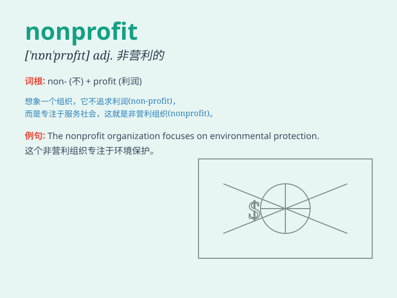

## nonprofit

**英音:** _[ˌnɒnˈprɒfɪt]_ **美音:** _[ˌnɑːnˈprɑːfɪt]_

**译义:** *adj.非赢利的,不以赢利为目的的,无利可图的*

### 短语

+ **nonprofit organization:** _非营利组织_

+ **nonprofit sector:** _非营利部门_

+ **nonprofit status:** _非营利地位_

+ **nonprofit model:** _非营利模式_

+ **nonprofit work:** _非营利工作_

### 例句

#### 例句1

> **The organization is a nonprofit dedicated to helping the
homeless.**

**中文翻译:** 该组织是一个致力于帮助无家可归者的非营利组织。

**单词释义:** 非营利的

#### 例句2

> **She works for a nonprofit that provides educational resources to
underprivileged children.**

**中文翻译:** 她在一家为贫困儿童提供教育资源的非营利组织工作。

**单词释义:** 非营利的

#### 例句3

> **Many nonprofits rely on donations and volunteers to operate.**

**中文翻译:** 许多非营利组织依靠捐款和志愿者来运营。

**单词释义:** 非营利的

### 背诵小故事

>
想象一个小镇，有个组织叫'爱心之家'，它不为赚钱，只帮助贫困的人们。这个组织就是'nonprofit'，因为'non'表示'非'，'profit'是'利润'，合起来就是'非营利的'。

**想象一个关于非营利组织的故事来辅助记忆'nonprofit'这个单词，意思是非营利的**

### 图义

