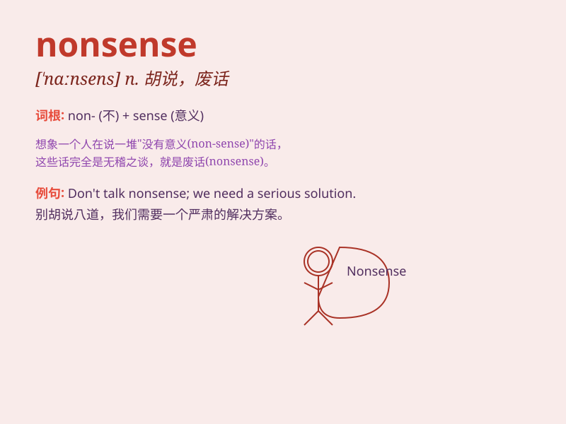

## nonsense

**英音:** _[\'nɒns(ə)ns]_ **美音:** _[\'nɑnsɛns]_

**译义:** *n.胡说,废话*

### 短语

+ **talk nonsense:** _胡说；乱说_

+ **utter nonsense:** _完全胡说；一派胡言_

+ **nonsense poem:** _荒诞诗_

+ **sheer nonsense:** _纯粹胡说；十足的废话_

+ **nonsense syllable:** _无意义音节_

### 例句

#### 例句1

> **Stop talking nonsense and get to work.**

**中文翻译:** 别废话了，赶紧干活吧。

**单词释义:** 无意义的话；胡说

#### 例句2

> **What he said was complete nonsense.**

**中文翻译:** 他所说的完全是无稽之谈。

**单词释义:** 废话；无意义的话

#### 例句3

> **I\'m not going to listen to such nonsense.**

**中文翻译:** 我不会听这样的废话。

**单词释义:** 胡言乱语

### 背诵小故事

> A man kept talking nonsense at the meeting. Everyone was annoyed. His
words made no sense and were just a waste of time. Finally, people asked
him to stop.

**一个男人在会议上一直说废话。每个人都很恼火。他的话毫无意义，纯粹是浪费时间。最后，人们叫他停止。**

### 图义

