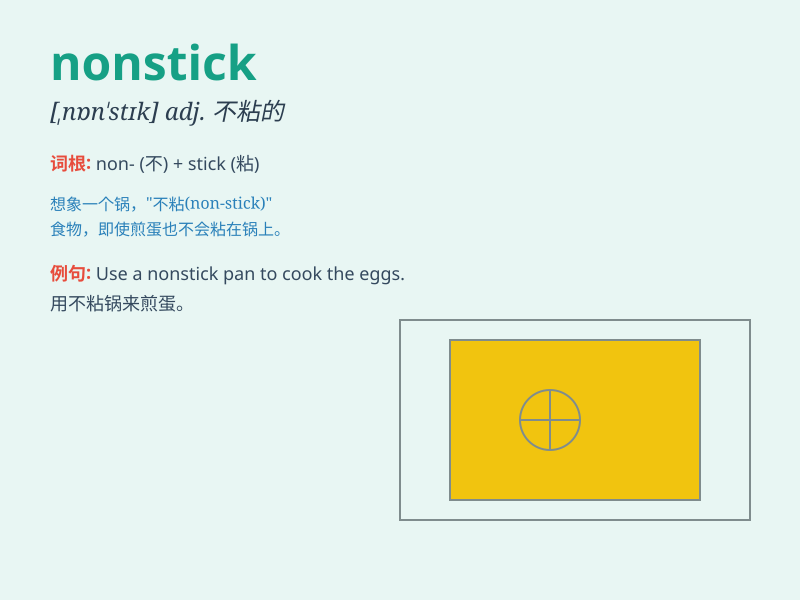

## nonstick

**英音:** _[ˈnɒn.stɪk]_ **美音:** _[ˈnɑːn.stɪk]_

**译义:**
*非粘着的，不粘的；指具有防止食物粘附于烹饪表面（如不粘锅）特性的一种材料或涂层*

### 短语

+ **nonstick coating:** _不粘涂层_

+ **nonstick pan:** _不粘锅_

+ **nonstick surface:** _不粘表面_

+ **nonstick cookware:** _不粘炊具_

+ **nonstick frying pan:** _不粘煎锅_

### 例句

#### 例句1

> **I bought a nonstick frying pan for cooking eggs.**

**中文翻译:** 我买了一个不粘锅来煎鸡蛋。

**单词释义:** 不粘锅的

#### 例句2

> **The nonstick coating on the pot makes cleaning very easy.**

**中文翻译:** 锅上的不粘涂层使清洁变得非常容易。

**单词释义:** 不粘的

#### 例句3

> **This nonstick baking sheet is perfect for making cookies.**

**中文翻译:** 这个不粘烤盘非常适合做饼干。

**单词释义:** 不粘的

### 背诵小故事

>
想象一下你在厨房做饭，锅总是粘锅，让你很烦恼。突然有一天，你得到了一口神奇的锅，它的表面
nonstick（不粘），无论煎什么都不会粘，轻松做出美味菜肴，真是太棒啦！

**想象你在厨房，锅总粘锅，很烦。某天得到一口神奇的不粘的锅，无论煎啥都不粘，能轻松做菜，很棒！**

### 图义

