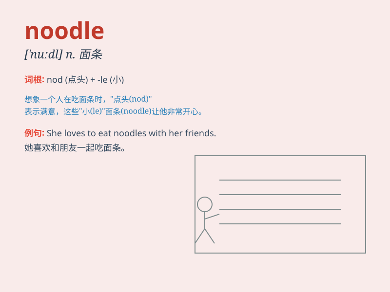

## noodle

**英音:** _[\'nuːd(ə)l]_ **美音:** _[\'nudl]_

**译义:** *n.面条(常用复数),笨蛋,傻瓜*

### 短语

+ **instant noodle:** _方便面_

+ **noodle soup:** _面汤_

+ **rice noodle:** _米粉_

+ **noodle dish:** _面条菜肴_

+ **udon noodle:** _乌冬面_

### 例句

#### 例句1

> **I like to eat noodles for lunch.**

**中文翻译:** 我午餐喜欢吃面条。

**单词释义:** 面条（常用复数形式）

#### 例句2

> **She is cooking some noodles in the kitchen.**

**中文翻译:** 她正在厨房里煮面条。

**单词释义:** 面条（常用复数形式）

#### 例句3

> **These noodles taste delicious.**

**中文翻译:** 这些面条味道鲜美。

**单词释义:** 面条（常用复数形式）

### 背诵小故事

> One day, a little monkey was very hungry. He found some long and thin
things. They were noodles! The monkey ate them happily and felt full.
From then on, whenever he was hungry, he thought of noodles.

**有一天，一只小猴子非常饿。它发现了一些又长又细的东西。它们是面条！猴子开心地吃了，觉得饱饱的。从那以后，每当它饿的时候，就会想起面条。**

### 图义

