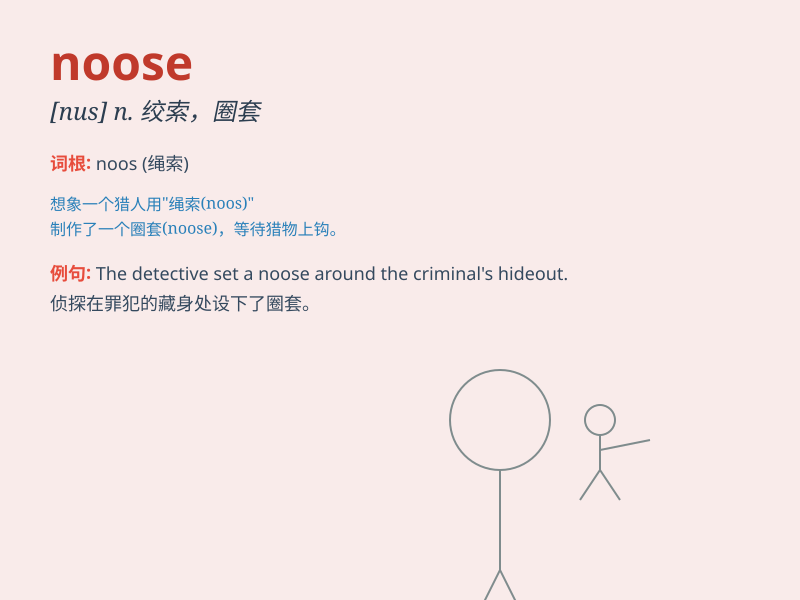

## noose

**英音:** _[nuːs]_ **美音:** _[nus]_

**译义:** *n.套索,束缚,陷阱,(the noose)绞刑vt.用套索捉*

### 短语

+ **slip the noose:** _逃脱困境；逃避惩罚_

+ **tighten the noose:** _收紧绞索；加强控制_

+ **put one\'s head in the noose:** _自找麻烦；自投罗网_

+ **hang by the noose:** _被绞死_

+ **noose of debt:** _债务的束缚_

### 例句

#### 例句1

> **The criminal was caught in a noose of his own making.**

**中文翻译:** 罪犯被自己制作的绞索缠住了。

**单词释义:** 绞索；套索；陷阱

#### 例句2

> **He put a noose around the horse\'s neck to lead it.**

**中文翻译:** 他在马脖子上套了一个套索来牵住它。

**单词释义:** 套索

#### 例句3

> **The noose tightened as he struggled to escape.**

**中文翻译:** 当他挣扎着逃跑时，绞索收紧了。

**单词释义:** 绞索

### 背诵小故事

> A thief was caught by the police. When he tried to escape, he saw a
noose hanging from a tree. He knew it was a trap but was too desperate.
Finally, he was caught in the noose and couldn\'t move.

**一个小偷被警察抓住了。当他试图逃跑时，他看到树上挂着一个套索。他知道这是个陷阱，但太绝望了。最后，他被套索套住，动弹不得。**

### 图义

