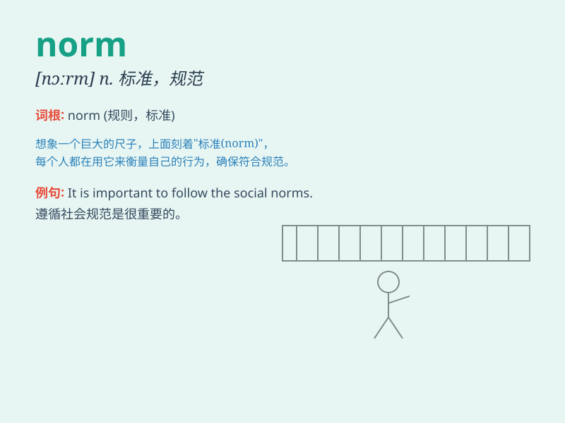

## norm

**英音:** _[nɔːm]_ **美音:** _[nɔrm]_

**译义:** *n.标准,规范*

### 短语

+ **social norm:** _社会规范_

+ **norm violation:** _规范违反_

+ **cultural norm:** _文化规范_

+ **deviate from the norm:** _偏离常规_

+ **established norm:** _既定规范_

### 例句

#### 例句1

> **The norm in this company is to work from 9 to 5.**

**中文翻译:** 这家公司的标准是朝九晚五的工作。

**单词释义:** 常规；标准

#### 例句2

> **Deviating from the norm can lead to criticism.**

**中文翻译:** 偏离规范可能会招致批评。

**单词释义:** 常规；规范

#### 例句3

> **It\'s becoming the norm to have a smart phone these days.**

**中文翻译:** 如今，拥有智能手机已成为一种常态。

**单词释义:** 常态；惯例

### 背诵小故事

> A group of students were confused about the rules of a game. The
teacher said, \'The norm is simple. Follow the steps I show you.\' Then
the students understood and had fun.

**一群学生对一个游戏的规则感到困惑。老师说："规范很简单。按照我给你们展示的步骤来。"然后学生们明白了，玩得很开心。**

### 图义

