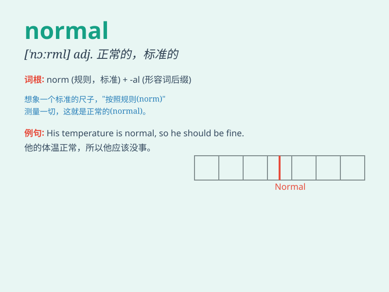

## normal

**英音:** _[\'nɔːm(ə)l]_ **美音:** _[\'nɔrml]_

**译义:** *n.正规,常态,[数学]法线adj.正常的,正规的,标准的*

### 短语

+ **normal school:** _师范学校_

+ **normal temperature:** _正常温度_

+ **normal state:** _正常状态_

+ **normal distribution:** _正态分布_

+ **return to normal:** _恢复正常_

### 例句

#### 例句1

> **It\'s normal to feel nervous before an exam.**

**中文翻译:** 考试前感到紧张是正常的。

**单词释义:** 正常的；平常的

#### 例句2

> **The doctor said his temperature was normal.**

**中文翻译:** 医生说他的体温正常。

**单词释义:** 正常的；标准的

#### 例句3

> **She led a normal life after the accident.**

**中文翻译:** 事故发生后，她过着正常的生活。

**单词释义:** 正常的；一般的

### 背诵小故事

> A student always followed the usual routine to study. He got up at
the same time, studied the same subjects, and did the same exercises.
This was his normal way of learning. Eventually, he achieved good
grades.

**一个学生总是遵循着平常的惯例去学习。他在相同的时间起床，学习相同的科目，做相同的练习。这就是他正常的学习方式。最终，他取得了好成绩。**

### 图义

