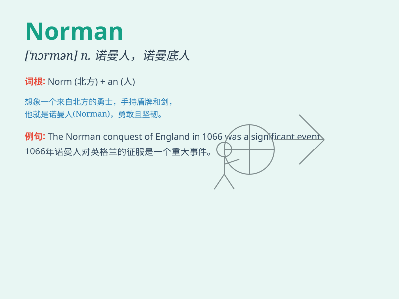

## Norman

**英音:** _[\'nɔːmən]_ **美音:** _[\'nɔːrmən]_

**译义:** *n. 诺曼人；诺曼底人；adj. 诺曼的；诺曼式的；诺曼底的*

### 短语

+ **Norman Conquest:** _诺曼征服（指 1066
年诺曼底公爵威廉对英格兰的征服）_

+ **Norman architecture:** _诺曼式建筑_

+ **Norman window:** _诺曼式窗户_

+ **Old Norman:** _古诺曼语_

+ **Norman French:** _诺曼法语_

### 例句

#### 例句1

> **Norman is a very talented musician.**

**中文翻译:** 诺曼是一位非常有才华的音乐家。

**单词释义:** 诺曼（人名）

#### 例句2

> **I met Norman at the party last night.**

**中文翻译:** 我昨晚在聚会上见到了诺曼。

**单词释义:** 诺曼（人名）

#### 例句3

> **Norman has been working hard for the exam.**

**中文翻译:** 诺曼一直在为考试努力学习。

**单词释义:** 诺曼（人名）

### 背诵小故事

> Once upon a time, there was a brave knight named Norman. He fought
bravely in many battles and became a hero. His name was known far and
wide. People praised his courage and skills. Remember Norman, the heroic
knight!

**从前，有一位勇敢的骑士叫诺曼。他在许多战斗中英勇作战，成为了英雄。他的名字远近闻名。人们称赞他的勇气和技能。记住诺曼，这位英勇的骑士！**

### 图义

