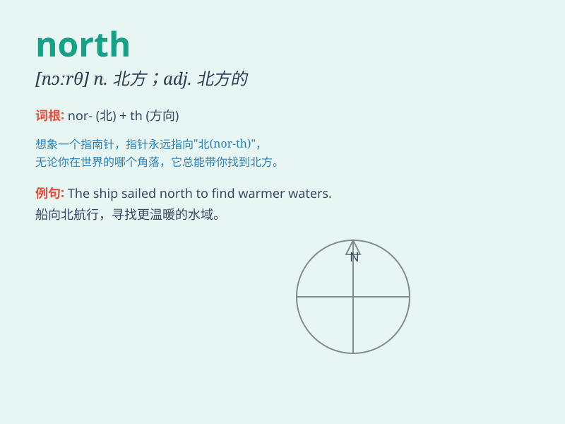

## north

**英音:** _[nɔːθ]_ **美音:** _[nɔrθ]_

**译义:** *n.北,北方,北部adj.北,北方的adv.在北方,向北方*

### 短语

+ **north pole:** _北极_

+ **north america:** _北美洲_

+ **north wind:** _北风_

+ **in the north:** _在北方_

+ **north of:** _在\...以北_

### 例句

#### 例句1

> **The wind is blowing from the north.**

**中文翻译:** 风从北边吹来。

**单词释义:** 北方

#### 例句2

> **He lives in a town to the north of the city.**

**中文翻译:** 他住在城北的一个小镇上。

**单词释义:** 北方；北部

#### 例句3

> **We are going north for our vacation.**

**中文翻译:** 我们要去北方度假。

**单词释义:** 向北；朝北

### 背诵小故事

> A brave adventurer was lost. He knew he had to go north to find his
way home. He followed the North Star and finally reached his warm house.
Remember, north means the direction towards which the adventurer headed.

**一位勇敢的冒险家迷路了。他知道必须向北才能找到回家的路。他跟着北极星，最终回到了温暖的家。记住，north
就是这位冒险家前进的方向。**

### 图义

