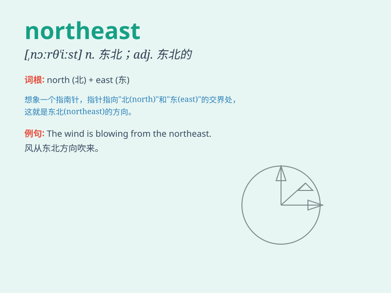

## northeast

**英音:** _[ˌnɔːθˈiːst]_ **美音:** _[ˌnɔrˈθist]_

**译义:** *n.东北adj.东北的*

### 短语

+ **northeast wind:** _东北风_

+ **northeast corner:** _东北角_

+ **northeast direction:** _东北方向_

+ **northeast region:** _东北地区_

+ **northeast China:** _中国东北_

### 例句

#### 例句1

> **The wind is blowing from the northeast.**

**中文翻译:** 风从东北吹来。

**单词释义:** 东北

#### 例句2

> **They traveled to the northeast of the country.**

**中文翻译:** 他们前往该国东北部。

**单词释义:** 东北部

#### 例句3

> **The Northeast is known for its cold winters.**

**中文翻译:** 东北以冬季寒冷而闻名。

**单词释义:** 东北地区

### 背诵小故事

> A brave adventurer set off from the center of the city. He walked
northeast for days, facing many challenges. Finally, he found a hidden
treasure in the mountains of the northeast.

**一位勇敢的冒险家从城市中心出发。他向东北走了好多天，面临诸多挑战。最终，他在东北的山里找到了一处隐藏的宝藏。**

### 图义

