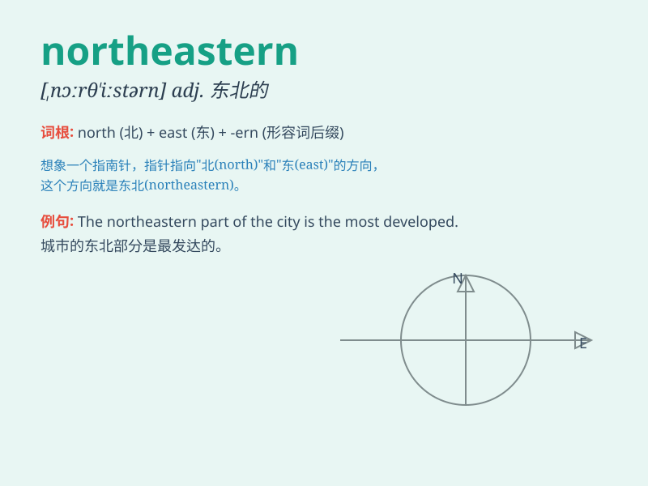

## northeastern

**英音:** _[ˌnɔːθˈiːstən]_ **美音:** _[ˌnɔrˈθistərn]_

**译义:** *adj.东北方的,来自东北的*

### 短语

+ **northeastern China:** _中国东北部_

+ **northeastern region:** _东北地区_

+ **northeastern university:** _东北大学_

+ **northeastern coast:** _东北海岸_

+ **northeastern wind:** _东北风_

### 例句

#### 例句1

> **The northeastern part of the country is known for its beautiful
mountains.**

**中文翻译:** 该国东北部以其美丽的山脉而闻名。

**单词释义:** 东北部的

#### 例句2

> **She moved to a northeastern city to start her new job.**

**中文翻译:** 她搬到东北城市开始新的工作。

**单词释义:** 东北方向的

#### 例句3

> **The northeastern wind brought a cold front.**

**中文翻译:** 东北风带来了一股冷锋。

**单词释义:** 东北的

### 背诵小故事

> A brave adventurer set off from the northeastern corner of the
forest. He faced many challenges but was determined to discover the
secrets hidden there. The northeastern path led him to a beautiful
waterfall.

**一位勇敢的探险家从森林的东北角落出发。他面临许多挑战，但决心发现那里隐藏的秘密。东北方向的小路将他引向了一个美丽的瀑布。**

### 图义

