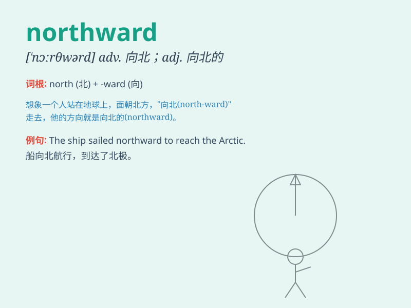

## northward

**英音:** _[\'nɔːθwəd]_ **美音:** _[\'nɔrθwɚdz]_

**译义:** *adv.向北adj.向北的*

### 短语

+ **northward journey:** _向北的旅程_

+ **northward movement:** _向北的移动_

+ **northward direction:** _向北的方向_

+ **travel northward:** _向北旅行_

+ **head northward:** _向北行进_

### 例句

#### 例句1

> **The birds flew northward for the winter.**

**中文翻译:** 鸟儿飞向北方过冬。

**单词释义:** 向北

#### 例句2

> **We started our journey northward at dawn.**

**中文翻译:** 黎明时分，我们开始了北上的旅程。

**单词释义:** 向北

#### 例句3

> **The wind was blowing northward, carrying the smell of the
sea.**

**中文翻译:** 风向北吹，带着大海的味道。

**单词释义:** 向北

### 背诵小故事

> A brave adventurer set off on a journey northward. He faced strong
winds but was determined to reach the mysterious land in the north. With
each step, he got closer to his destination, guided by the stars.

**一位勇敢的冒险家踏上了向北的旅程。他顶着强风，但决心要到达北方那片神秘的土地。每走一步，他都在星星的指引下离目的地更近。**

### 图义

