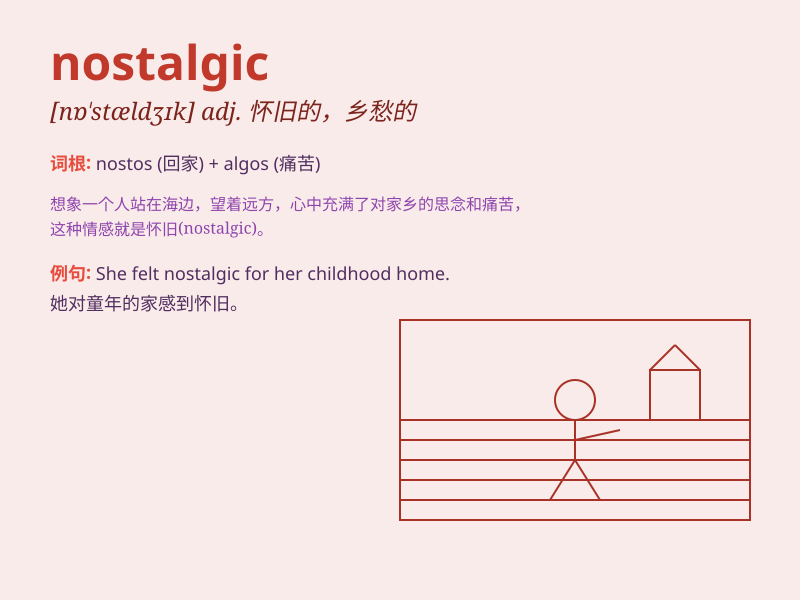

## nostalgic

**英音:** _[nɒ\'stældʒɪk]_ **美音:** _[nɒ\'stældʒɪk]_

**译义:** *adj.乡愁的,怀旧的*

### 短语

+ **nostalgic feeling:** _怀旧的感觉_

+ **nostalgic memories:** _怀旧的回忆_

+ **nostalgic journey:** _怀旧之旅_

+ **nostalgic mood:** _怀旧的心情_

+ **nostalgic story:** _怀旧的故事_

### 例句

#### 例句1

> **She felt nostalgic when she saw the old photographs.**

**中文翻译:** 当她看到那些旧照片时，她感到很怀旧。

**单词释义:** 怀旧的；怀念过去的

#### 例句2

> **The song has a nostalgic melody that takes people back to their
youth.**

**中文翻译:** 这首歌有着怀旧的旋律，能把人们带回到他们的青春时代。

**单词释义:** 引起怀旧之情的

#### 例句3

> **He became nostalgic for the simple life of his hometown.**

**中文翻译:** 他开始怀念家乡那种简单的生活。

**单词释义:** 怀旧的；留恋过去的

### 背诵小故事

> A man was listening to an old song and suddenly felt nostalgic. He
remembered the happy days of his childhood, playing in the fields and
having fun with friends. This feeling made him realize that nostalgic
means having a sentimental longing for the past.

**一个男人正在听一首老歌，突然感到怀旧。他想起了童年的快乐时光，在田野里玩耍和与朋友们玩乐。这种感觉让他明白nostalgic是指对过去怀有伤感的渴望。**

### 图义

