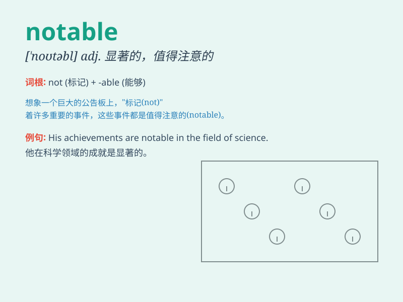

## notable

**英音:** _[\'nəʊtəb(ə)l]_ **美音:** _[\'notəbl]_

**译义:** *adj.值得注意的,显著的,著名的*

### 短语

+ **notable achievement:** _显著成就_

+ **notable figure:** _著名人物_

+ **notable event:** _重大事件_

+ **notable exception:** _显著的例外_

+ **notable feature:** _显著特点_

### 例句

#### 例句1

> **The scientist made a notable discovery in the field of
medicine.**

**中文翻译:** 这位科学家在医学领域取得了一项显着的发现。

**单词释义:** 显著的；值得注意的

#### 例句2

> **She is a notable figure in the art world.**

**中文翻译:** 她是艺术界的一位著名人物。

**单词释义:** 著名的；重要的

#### 例句3

> **The event attracted several notable guests.**

**中文翻译:** 此次活动吸引了多位知名嘉宾。

**单词释义:** 重要的；显要的

### 背诵小故事

> A young artist was always overlooked. But one day, his unique
painting style made him notable. Everyone started to notice and praise
his work. Now, he\'s famous for being remarkable and outstanding.

**一位年轻的艺术家一直被忽视。但有一天，他独特的绘画风格使他引人注目。每个人都开始注意并称赞他的作品。现在，他因出色和杰出而闻名。**

### 图义

