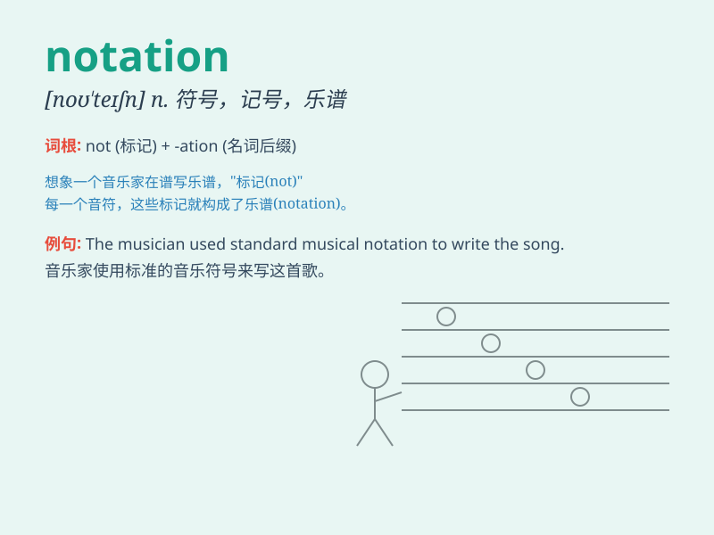

## notation

**英音:** _[nəʊ\'teɪʃ(ə)n]_ **美音:** _[noʊˈteɪʃən]_

**译义:** *n.符号*

### 短语

+ **mathematical notation:** _数学符号_

+ **musical notation:** _乐谱；音乐记谱法_

+ **chemical notation:** _化学符号_

+ **graphical notation:** _图形符号_

+ **scientific notation:** _科学记数法_

### 例句

#### 例句1

> **The musical notation is very complex for beginners.**

**中文翻译:** 对于初学者来说，乐谱非常复杂。

**单词释义:** 符号；记号

#### 例句2

> **She uses a special notation to keep track of her expenses.**

**中文翻译:** 她使用特殊的符号来记录她的开支。

**单词释义:** 记号；标记

#### 例句3

> **The notation in this math textbook is quite confusing.**

**中文翻译:** 这本数学教科书中的符号非常混乱。

**单词释义:** 符号；记法

### 背诵小故事

> A musician was constantly confused by the various notations in the
score. One day, he decided to study hard and finally understood all the
notations, which made his performance perfect.

**一位音乐家总是被乐谱中的各种符号（notation）搞得晕头转向。有一天，他决定努力学习，终于明白了所有的符号，这让他的演奏变得完美。**

### 图义

