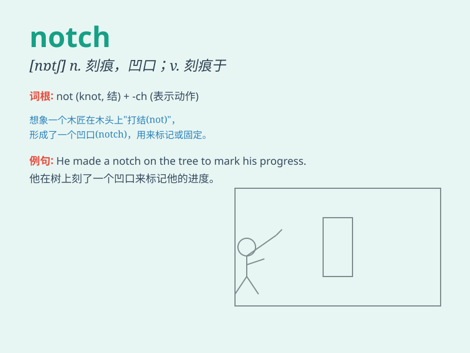

## notch

**英音:** _[nɒtʃ]_ **美音:** _[nɑtʃ]_

**译义:**
*n.槽口,凹口vt.刻凹痕,用刻痕计算,开槽,切口,得分n.\<美语>山间小路,刻痕,峡谷*

### 短语

+ **notch up:** _获得；达到_

+ **top notch:** _一流的；顶级的_

+ **notch on a stick:** _刻痕木签（用于计数等）_

+ **notch in one\'s belt:** _个人成就；业绩_

+ **cut a notch:** _刻一道凹痕_

### 例句

#### 例句1

> **He managed to notch a victory in the final game.**

**中文翻译:** 他在最后一场比赛中取得了胜利。

**单词释义:** 获得；赢得

#### 例句2

> **The woodcutter made a notch in the tree to mark the spot.**

**中文翻译:** 樵夫在树上刻了一个缺口来标记这个位置。

**单词释义:** 刻痕；作凹口

#### 例句3

> **She has reached another notch in her career with this
promotion.**

**中文翻译:** 通过这次晋升，她的职业生涯又上了一个台阶。

**单词释义:** 等级；档次

### 背诵小故事

> A brave adventurer climbed a tall mountain and found a hidden notch
on a cliff. He marked the notch to remember the special place. Later,
whenever he thought of the notch, he recalled his adventurous journey.

**一位勇敢的冒险家爬上了一座高山，在悬崖上发现了一个隐蔽的凹口。他标记了这个凹口以记住这个特别的地方。后来，每当他想到这个凹口，就会回想起他的冒险之旅。**

### 图义

