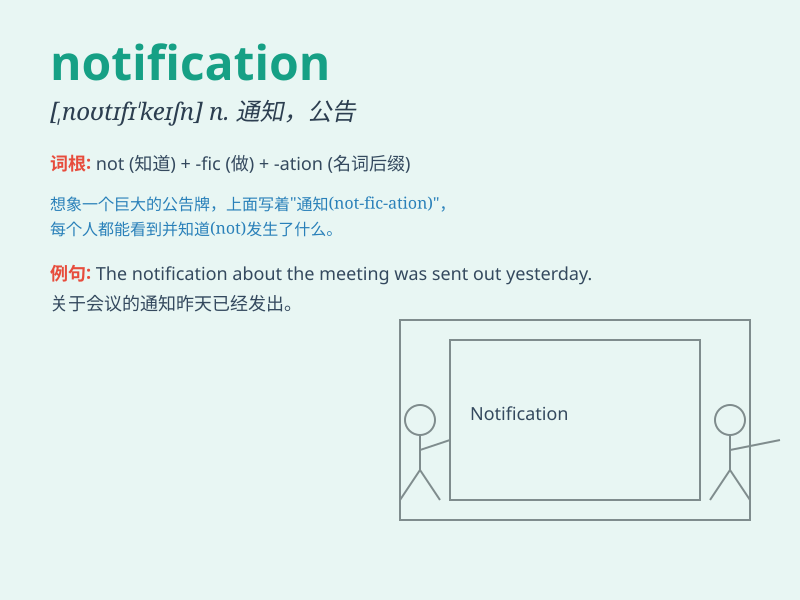

## notification

**英音:** _[,nəʊtɪfɪ\'keɪʃn]_ **美音:**
_[\'notəfə\'keʃən]_

**译义:** *n.通知,布告,告示*

### 短语

+ **notification letter:** _通知函_

+ **notification system:** _通知系统_

+ **email notification:** _电子邮件通知_

+ **push notification:** _推送通知_

+ **notification bar:** _通知栏_

### 例句

#### 例句1

> **I received a notification that my package has been delivered.**

**中文翻译:** 我收到了包裹已送达的通知。

**单词释义:** 通知；告知

#### 例句2

> **Please check your email for important notifications.**

**中文翻译:** 请检查您的电子邮件以获取重要通知。

**单词释义:** 通知；通告

#### 例句3

> **The app sends notifications to remind you of upcoming events.**

**中文翻译:** 该应用程序会发送通知来提醒您即将发生的事件。

**单词释义:** 通知；提醒

### 背诵小故事

> One day, Tom was waiting anxiously for a notification. Finally, he
got a message on his phone saying he won the lottery. The notification
made him jump with joy.

**一天，汤姆焦急地等待着一则通知。最后，他的手机收到一条消息说他中了彩票。这则通知让他高兴得跳了起来。**

### 图义

