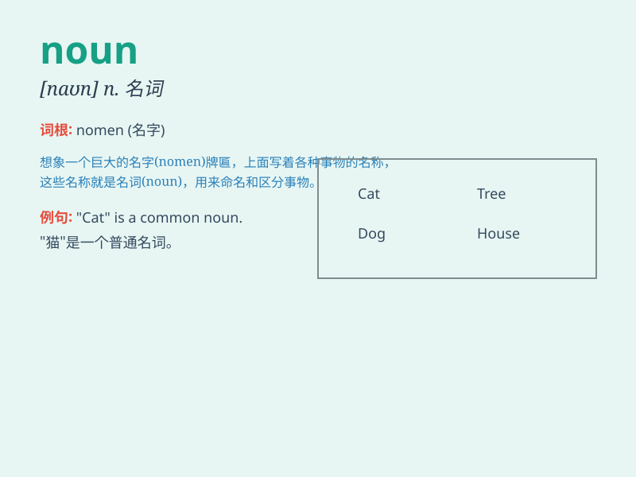

## noun

**英音:** _[naʊn]_ **美音:** _[naʊn]_

**译义:** *n.名词*

### 短语

+ **common noun:** _普通名词_

+ **abstract noun:** _抽象名词_

+ **collective noun:** _集合名词_

+ **countable noun:** _可数名词_

+ **uncountable noun:** _不可数名词_

### 例句

#### 例句1

> **A dog is a common noun.**

**中文翻译:** 狗是一个普通名词。

**单词释义:** 名词

#### 例句2

> **In the sentence \'The boy is running\', \'boy\' is a noun.**

**中文翻译:** 在"男孩正在跑步"这句话中，"男孩"是一个名词。

**单词释义:** 名词

#### 例句3

> **Proper nouns, like \'London\' and \'John\', start with a capital
letter.**

**中文翻译:** 专有名词，如"London"和"John"，以大写字母开头。

**单词释义:** 名词

### 背诵小故事

> One day, a little ant was looking for food. It saw a big noun written
on a leaf. It didn\'t know what it meant. So, it asked a wise owl. The
owl explained that a noun is a name of a person, place, thing or idea.
The ant understood.

**有一天，一只小蚂蚁在找食物。它看到一片叶子上写着一个大大的"noun"。它不知道这是什么意思。于是，它问了一只聪明的猫头鹰。猫头鹰解释说，名词是一个人、地方、事物或想法的名称。小蚂蚁明白了。**

### 图义

