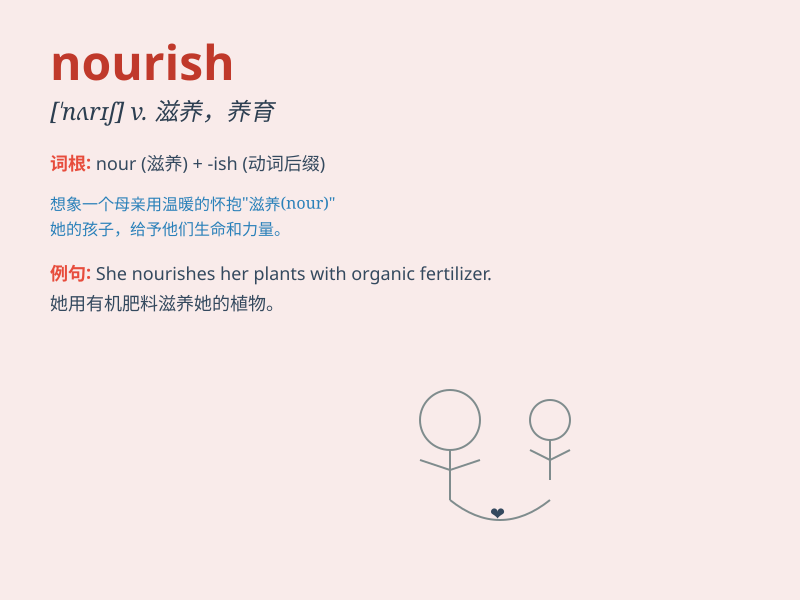

## nourish

**英音:** _[\'nʌrɪʃ]_ **美音:** _[\'nɜrɪʃ]_

**译义:** *vt.滋养,使健壮,怀有(希望,仇恨等)*

### 短语

+ **nourish hope:** _滋养希望_

+ **nourish the body:** _滋养身体_

+ **nourish plants:** _滋养植物_

+ **nourish a child:** _养育孩子_

+ **nourish the soul:** _滋养灵魂_

### 例句

#### 例句1

> **The mother nourishes her baby with love and care.**

**中文翻译:** 母亲用爱和关怀滋养她的孩子。

**单词释义:** 滋养；养育

#### 例句2

> **Good books can nourish the mind.**

**中文翻译:** 好书可以滋养心灵。

**单词释义:** 滋养；丰富

#### 例句3

> **The soil needs to be nourished to grow healthy plants.**

**中文翻译:** 土壤需要滋养才能生长健康的植物。

**单词释义:** 给\...提供营养；使肥沃

### 背诵小故事

> Once upon a time, a little plant was struggling to grow. But with the
right soil and water, it was nourished and became strong. Just like the
plant, we need good food and care to nourish our bodies and minds.

**从前，有一株小植物在努力生长。但有了合适的土壤和水，它得到滋养并变得强壮。就像这株植物一样，我们需要良好的食物和关怀来滋养我们的身心。**

### 图义

