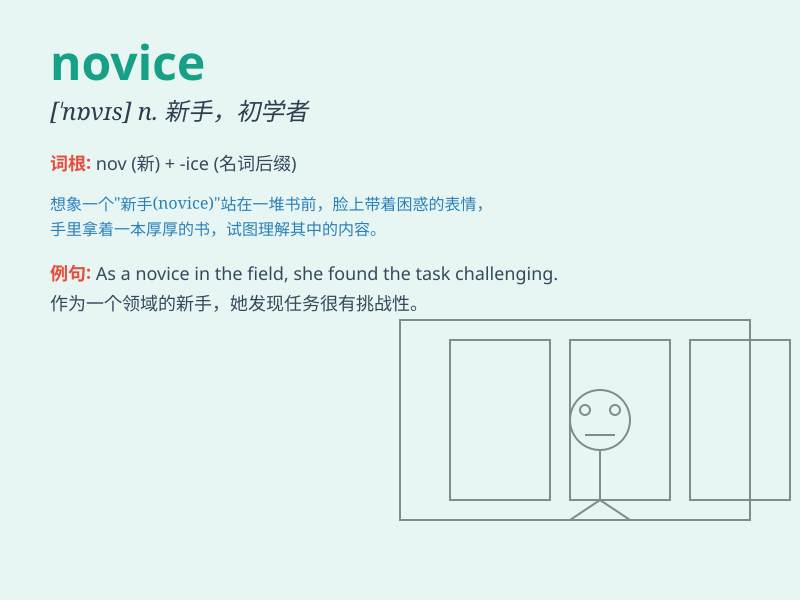

## novice

**英音:** _[\'nɒvɪs]_ **美音:** _[\'nɑvɪs]_

**译义:** *n.新手,初学者*

### 短语

+ **novice driver:** _新手司机_

+ **novice skier:** _滑雪新手_

+ **novice sailor:** _新水手_

+ **novice learner:** _新学者_

+ **novice player:** _新手玩家_

### 例句

#### 例句1

> **The novice driver struggled to parallel park.**

**中文翻译:** 新手司机很难平行停车。

**单词释义:** 新手

#### 例句2

> **She\'s a novice at skiing and still learning the basics.**

**中文翻译:** 她是滑雪新手，仍在学习基础知识。

**单词释义:** 新手

#### 例句3

> **The novice chef made a few mistakes in the recipe.**

**中文翻译:** 新手厨师在菜谱上犯了一些错误。

**单词释义:** 新手

### 背诵小故事

> A novice named Lily started learning to play the piano. She made many
mistakes at first but kept practicing. With time and effort, she
improved and was no longer a novice but a skilled player.

**一个叫莉莉的新手开始学习弹钢琴。起初她犯了很多错误，但一直练习。随着时间和努力，她进步了，不再是新手而是熟练的演奏者。**

### 图义

