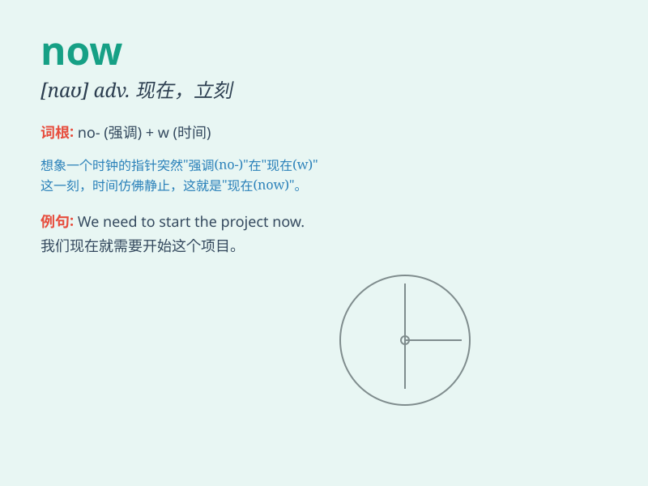

## now

**英音:** _[naʊ]_ **美音:** _[naʊ]_

**译义:** *adv.现在,目前,此刻,立刻,马上n.现在,如今 conj.既然*

### 短语

+ **right now:** _立即；此刻_

+ **up to now:** _到目前为止_

+ **now and then:** _偶尔；有时_

+ **from now on:** _从现在起_

+ **now that:** _既然；由于_

### 例句

#### 例句1

> **Now is the best time to start.**

**中文翻译:** 现在是开始的最佳时机。

**单词释义:** 现在

#### 例句2

> **I\'m very busy now.**

**中文翻译:** 我现在很忙。

**单词释义:** 现在

#### 例句3

> **Now that you are here, let\'s start the party.**

**中文翻译:** 既然你来了，我们就开始聚会吧。

**单词释义:** 既然；现在

### 背诵小故事

> A little boy was lost in the forest. He was very scared and didn\'t
know what to do. But then he said to himself, \'Now, I must be brave and
find a way out!\'

**一个小男孩在森林里迷路了。他非常害怕，不知道该怎么办。但随后他对自己说：'现在，我必须勇敢，找到出路！'**

### 图义

