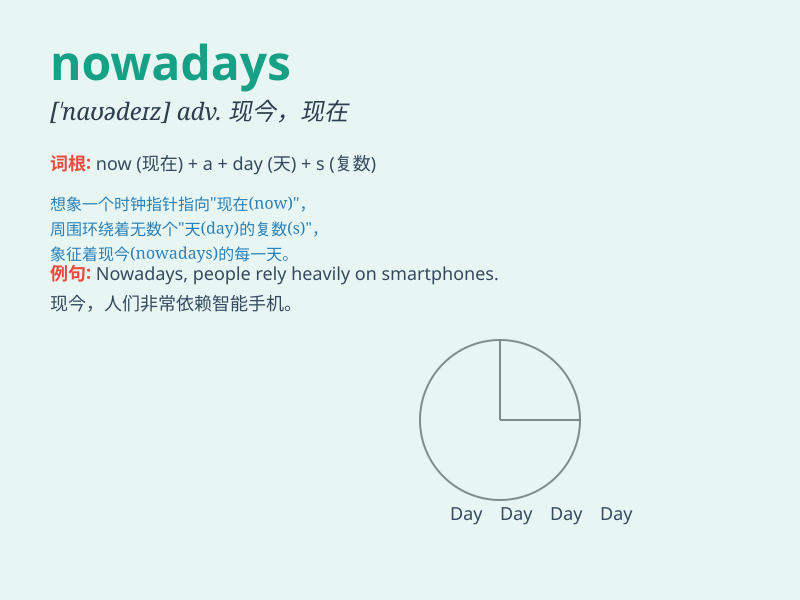

## nowadays

**英音:** _[\'naʊədeɪz]_ **美音:** _[\'naʊədez]_

**译义:** *adv.现今,现在*

### 短语

+ **nowadays society:** _当今社会_

+ **nowadays situation:** _当今形势_

+ **nowadays trend:** _当今趋势_

+ **nowadays life:** _当今生活_

+ **nowadays youth:** _当今青年_

### 例句

#### 例句1

> **Nowadays, many people prefer to shop online.**

**中文翻译:** 如今，许多人更喜欢在网上购物。

**单词释义:** 如今，现今

#### 例句2

> **Nowadays, it\'s common to see people using smartphones
everywhere.**

**中文翻译:** 如今，随处可见人们使用智能手机。

**单词释义:** 现今，当下

#### 例句3

> **Nowadays, children have more access to various forms of
entertainment.**

**中文翻译:** 如今，孩子们有更多机会接触各种形式的娱乐活动。

**单词释义:** 如今，现在

### 背诵小故事

> Once upon a time, people didn\'t have many conveniences. Nowadays, we
have smartphones and fast transportation. It shows how things have
changed over time.

**从前，人们没有很多便利。如今，我们有智能手机和快速的交通。这展示了随着时间事物是如何变化的。**

### 图义

