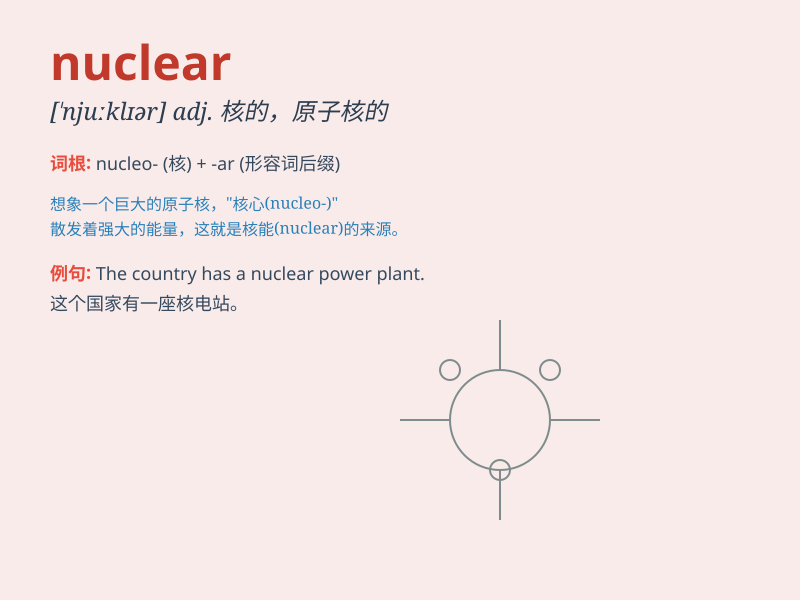

## nuclear

**英音:** _[\'njuːklɪə]_ **美音:** _[\'nuklɪɚ]_

**译义:** *adj.[核]核子的,原子能的,核的,中心的*

### 短语

+ **nuclear family:** _核心家庭；小家庭（只包括父母和子女）_

+ **nuclear power:** _核能；核动力_

+ **nuclear weapon:** _核武器_

+ **nuclear energy:** _核能；原子能_

+ **nuclear reactor:** _核反应堆_

### 例句

#### 例句1

> **The country has developed advanced nuclear technology.**

**中文翻译:** 该国已开发出先进的核技术。

**单词释义:** 核的；核能的

#### 例句2

> **A nuclear family consists of parents and their children.**

**中文翻译:** 核心家庭由父母及其子女组成。

**单词释义:** 核心的

#### 例句3

> **The threat of nuclear war is a global concern.**

**中文翻译:** 核战争的威胁是全球关注的问题。

**单词释义:** 核武器的；核战争的

### 背诵小故事

>
想象一下，在一个神秘的实验室里，科学家们正在研究一种强大的能量源。这个能量源被称为'nuclear'，它就像一个超级核心，拥有巨大的能量，但也需要小心控制，否则会带来危险。

**想象一下，在一个神秘的实验室里，科学家们正在研究一种被称为'核能的'强大能量源，它像超级核心，能量巨大但需小心控制，否则危险。**

### 图义

