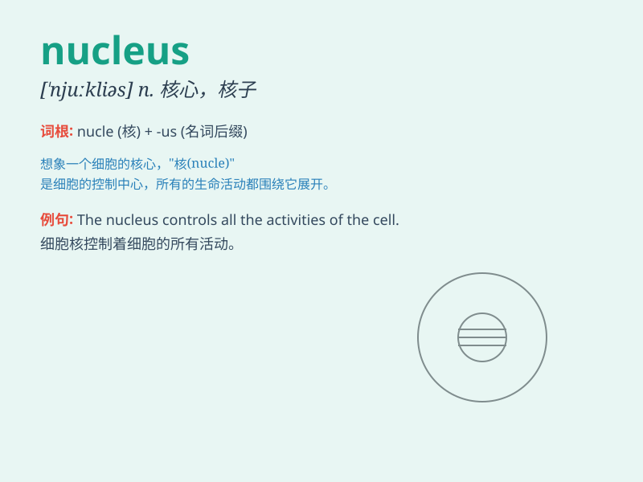

## nucleus

**英音:** _[\'njuːklɪəs]_ **美音:** _[\'nuklɪəs]_

**译义:** * [nuclear的复数,见nuclear];n.核子*

### 短语

+ **cell nucleus:** _细胞核_

+ **atomic nucleus:** _原子核_

+ **nucleus pulposus:** _髓核_

+ **nucleus accumbens:** _伏隔核_

+ **nucleus of solitary tract:** _孤束核_

### 例句

#### 例句1

> **The nucleus of the atom contains protons and neutrons.**

**中文翻译:** 原子核含有质子和中子。

**单词释义:** 原子核

#### 例句2

> **The family is often regarded as the nucleus of society.**

**中文翻译:** 家庭常常被视为社会的核心。

**单词释义:** 核心

#### 例句3

> **A few people formed the nucleus of the club.**

**中文翻译:** 几个人组成了俱乐部的核心。

**单词释义:** 核心（成员）

### 背诵小故事

>
想象一个巨大的原子，中心有一个小小的圆球，这个圆球就像细胞核一样掌控着一切。这个圆球就是
nucleus，它是原子的核心，也是事物的关键核心部分。

**想象一个原子，中心的圆球就是【nucleus（核心；原子核）】，它是原子和事物的关键核心部分。**

### 图义

