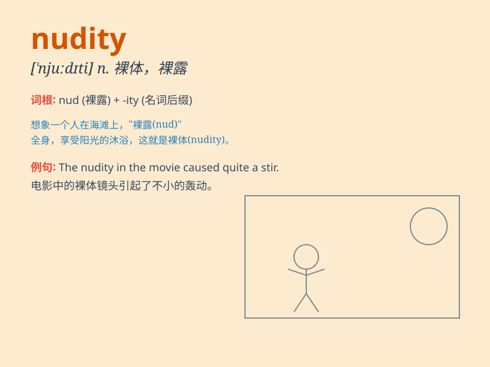

## nudity

**英音:** _[\'njuːdətɪ]_ **美音:** _[\'nudəti]_

**译义:** *n.裸体,赤裸*

### 短语

+ **public nudity:** _公共场合裸体_

+ **indecent nudity:** _不雅裸体_

+ **full nudity:** _全裸_

+ **partial nudity:** _部分裸体_

+ **artistic nudity:** _艺术裸体_

### 例句

#### 例句1

> **The film was criticized for its excessive nudity.**

**中文翻译:** 这部电影因过度裸露而受到批评。

**单词释义:** 裸体

#### 例句2

> **The art exhibition caused controversy due to the display of
nudity.**

**中文翻译:** 此次艺术展因裸体展示而引发争议。

**单词释义:** 裸体

#### 例句3

> **She was shocked by the unexpected nudity in the play.**

**中文翻译:** 她对剧中意想不到的裸体感到震惊。

**单词释义:** 裸体

### 背诵小故事

> A curious artist was exploring a hidden cave. To his surprise, he saw
paintings depicting nudity. It made him realize the raw and unclothed
form can convey deep emotions. From then on, he never forgot the word
\'nudity\'.

**一位好奇的艺术家正在探索一个隐蔽的洞穴。令他惊讶的是，他看到了描绘裸体的画作。这让他明白了'裸体'这个原始和未着衣的形态可以传达深刻的情感。从那以后，他再也没有忘记'nudity'这个词。**

### 图义

