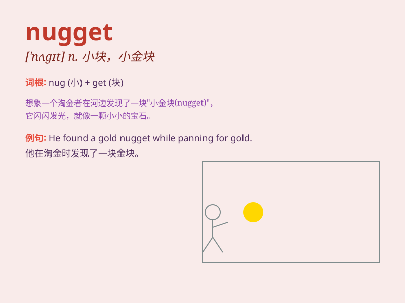

## nugget

**英音:** _[\'nʌgɪt]_ **美音:** _[\'nʌɡɪt]_

**译义:** *n.天然金块*

### 短语

+ **gold nugget:** _金块_

+ **chicken nugget:** _鸡块_

+ **nugget of wisdom:** _智慧的结晶；宝贵的见解_

+ **nugget of information:** _有价值的信息片段_

+ **nugget of truth:** _真理的核心；真实的要点_

### 例句

#### 例句1

> **The chicken nuggets are very popular among children.**

**中文翻译:** 鸡块很受孩子们的欢迎。

**单词释义:** 小块，小部分（指食物，这里指鸡块）

#### 例句2

> **He found a nugget of gold in the river.**

**中文翻译:** 他在河里发现了一块金子。

**单词释义:** 天然金块

#### 例句3

> **The article contains some valuable nuggets of information.**

**中文翻译:** 这篇文章包含一些有价值的信息。

**单词释义:** 有价值的部分，重要信息

### 背诵小故事

> A miner was digging in the cave. After a long time, he found a small
but shiny nugget. It was like a hidden treasure. He was so excited as
this nugget could change his life.

**一位矿工在山洞里挖掘。很久之后，他发现了一块小却闪闪发光的金块。它就像一个隐藏的宝藏。他非常兴奋，因为这块金块能改变他的生活。**

### 图义

