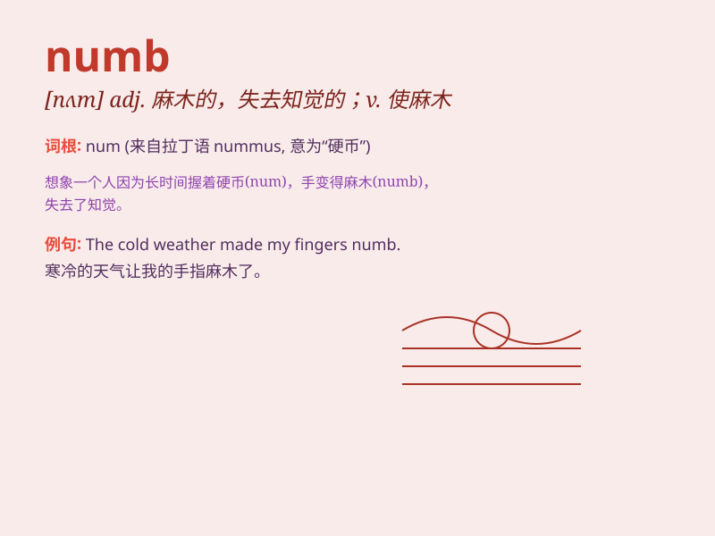

## numb

**英音:** _[nʌm]_ **美音:** _[nʌm]_

**译义:** *adj.麻木的v.失去知觉*

### 短语

+ **go numb:** _变得麻木_

+ **numb with cold:** _冻得麻木_

+ **numb fingers:** _麻木的手指_

+ **numb pain:** _减轻疼痛_

+ **numb sensation:** _麻木的感觉_

### 例句

#### 例句1

> **My fingers were numb with cold.**

**中文翻译:** 我的手指冻得麻木了。

**单词释义:** 麻木的；失去知觉的

#### 例句2

> **The shock left me numb.**

**中文翻译:** 震惊让我麻木了。

**单词释义:** 惊呆的；发愣的

#### 例句3

> **The medicine made her leg numb.**

**中文翻译:** 药使她的腿麻木了。

**单词释义:** 使麻木；使失去知觉

### 背诵小故事

> A brave climber got stuck on a mountain peak in a snowstorm. The
extreme cold made his body NUMB. But he held on until rescue arrived.
NUMB means lacking the ability to feel or move normally.

**一位勇敢的登山者在暴风雪中被困在山顶。极度的寒冷使他的身体麻木了。但他一直坚持到救援到来。Numb
意思是失去正常感觉或活动的能力。**

### 图义

