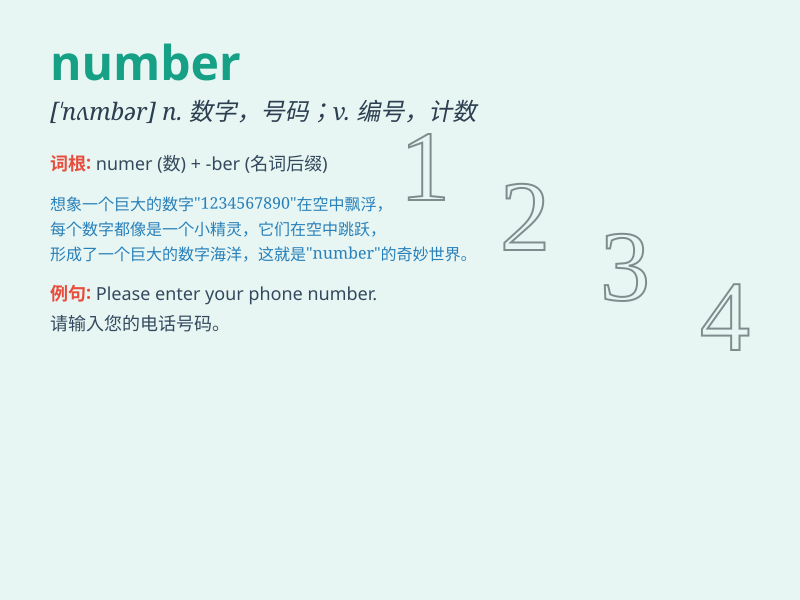

## number

**英音:** _[\'nʌmbə]_ **美音:** _[\'nʌmbɚ]_

**译义:**
*n.数,数字,数量,号码,算术,诗,韵律v.遍号码,共计\...,计入,计算,算入*

### 短语

+ **a number of:** _许多；若干_

+ **the number of:** _\...\...的数量_

+ **any number of:** _许多；大量_

+ **beyond number:** _数不清；不计其数_

+ **in number:** _总共；在数字上_

### 例句

#### 例句1

> **The number of students in our class is 50.**

**中文翻译:** 我们班的学生人数是 50 人。

**单词释义:** 数量

#### 例句2

> **She dialed the wrong number.**

**中文翻译:** 她拨错了号码。

**单词释义:** 号码

#### 例句3

> **My lucky number is 7.**

**中文翻译:** 我的幸运数字是7。

**单词释义:** 数字

### 背诵小故事

> One day, a little boy was lost in a big city. He needed to call his
parents but forgot their phone number. He was very worried. Finally,
with the help of a kind policeman, he found the number and went home
safely.

**有一天，一个小男孩在大城市里迷路了。他需要打电话给父母，但忘记了他们的电话号码。他非常担心。最后，在一位好心警察的帮助下，他找到了号码，安全地回家了。**

### 图义

