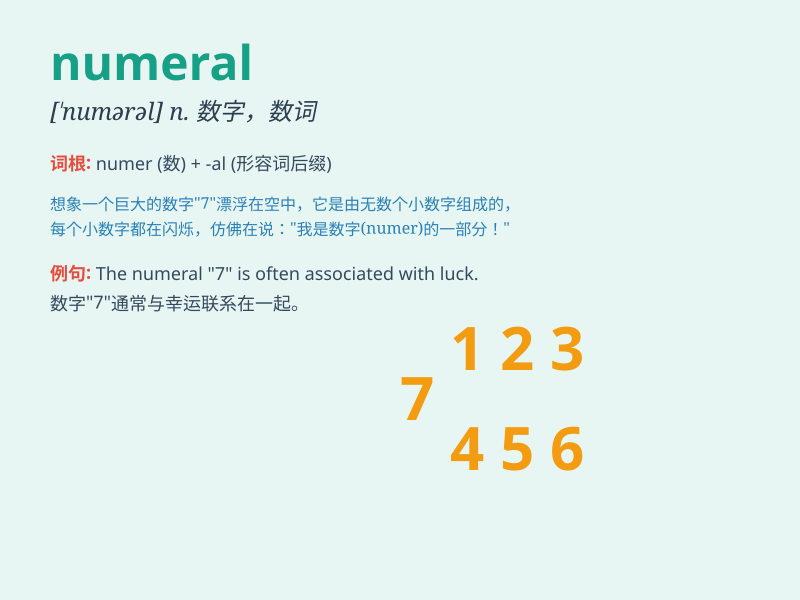

## numeral

**英音:** _[\'njuːm(ə)r(ə)l]_ **美音:** _[\'numərəl]_

**译义:** *n.数字*

### 短语

+ **Arabic numeral:** _阿拉伯数字_

+ **Roman numeral:** _罗马数字_

+ **cardinal numeral:** _基数词_

+ **ordinal numeral:** _序数词_

+ **complex numeral:** _复数_

### 例句

#### 例句1

> **The numeral 5 is written on the blackboard.**

**中文翻译:** 黑板上写着数字5。

**单词释义:** 数字

#### 例句2

> **In this equation, the numeral 2 represents a constant.**

**中文翻译:** 在此等式中，数字2代表常数。

**单词释义:** 数字

#### 例句3

> **The ancient text contains many strange numerals.**

**中文翻译:** 古代文献中包含许多奇怪的数字。

**单词释义:** 数字

### 背诵小故事

> Once upon a time, a little boy was confused by numbers. But when he
learned about \'numeral\', which represents numbers in written form, he
could solve math problems easily. Now he loves numerals!

**从前，有个小男孩对数字感到困惑。但当他了解到代表书面形式数字的"numeral"后，就能轻松解决数学问题了。现在他喜欢上了数字！**

### 图义

