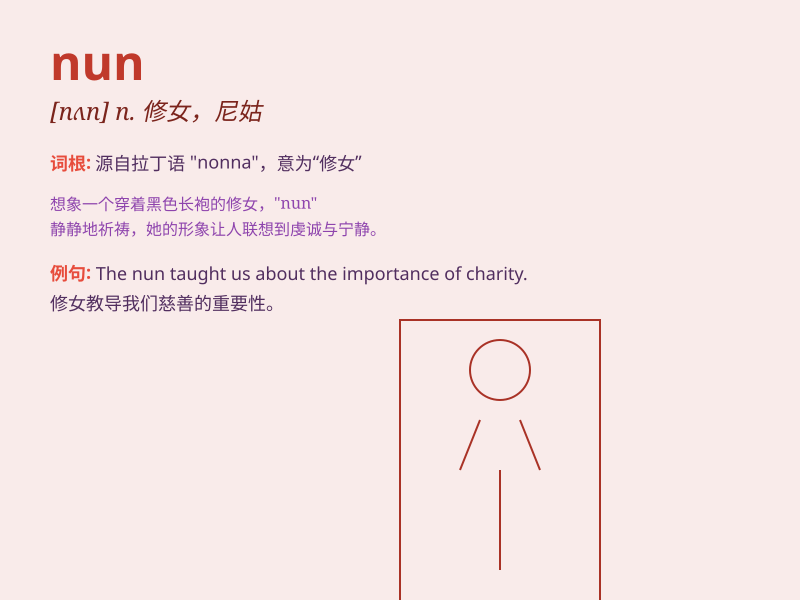

## nun

**英音:** _[nʌn]_ **美音:** _[nʌn]_

**译义:** *n.修女,尼姑*

### 短语

+ **nun bird:** _修女鸟_

+ **buddhist nun:** _尼姑_

+ **nun cap:** _修女头巾_

+ **nun habit:** _修女服_

+ **order of nuns:** _修女会_

### 例句

#### 例句1

> **The nun devoted her life to serving God.**

**中文翻译:** 修女一生致力于事奉上帝。

**单词释义:** 修女

#### 例句2

> **The old nun was kind and gentle to everyone.**

**中文翻译:** 老尼姑对每个人都很和善、温柔。

**单词释义:** 修女

#### 例句3

> **She dressed up as a nun for the costume party.**

**中文翻译:** 她打扮成修女去参加化装舞会。

**单词释义:** 修女

### 背诵小故事

>
从前有个小女孩，她总是独自一人在安静的寺庙里。有一天，她决定穿上黑袍，成为一名
nun（修女），从此将自己的一生奉献给宗教，为人们带去心灵的慰藉。

**从前有个小女孩，她决定成为一名修女，将一生奉献给宗教，为人们带去心灵慰藉。**

### 图义

