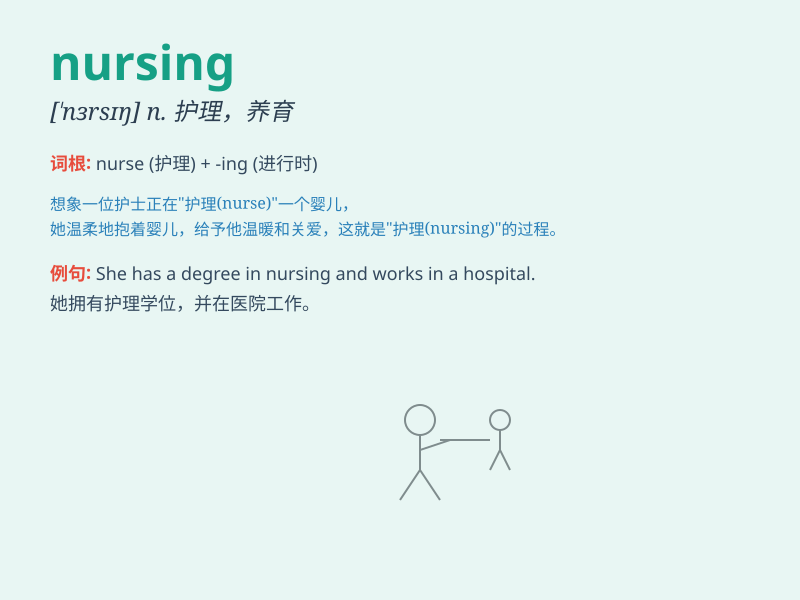

## nursing

**英音:** _[\'nɜːsɪŋ]_ **美音:** _[\'nɝsɪŋ]_

**译义:** *n.看护,养育*

### 短语

+ **nursing home:** _养老院；疗养院_

+ **nursing staff:** _护理人员_

+ **nursing care:** _护理；护理服务_

+ **nursing mother:** _哺乳期的母亲_

+ **nursing profession:** _护理专业_

### 例句

#### 例句1

> **She is studying nursing at the university.**

**中文翻译:** 她正在大学学习护理专业。

**单词释义:** 护理学

#### 例句2

> **The nursing staff is very kind and professional.**

**中文翻译:** 护理人员非常友善和专业。

**单词释义:** 护理（工作）

#### 例句3

> **He decided to pursue a career in nursing.**

**中文翻译:** 他决定从事护理事业。

**单词释义:** 护理（职业）

### 背诵小故事

> A young girl named Lily decided to pursue nursing. She worked hard in
the hospital, caring for patients day and night. Through her efforts,
she became an excellent nurse. Nursing is not just a job for her, but a
calling to help others.

**一个叫莉莉的年轻女孩决定从事护理工作。她在医院努力工作，日夜照顾病人。通过她的努力，她成为了一名出色的护士。护理对她来说不仅是一份工作，更是帮助他人的使命。**

### 图义

