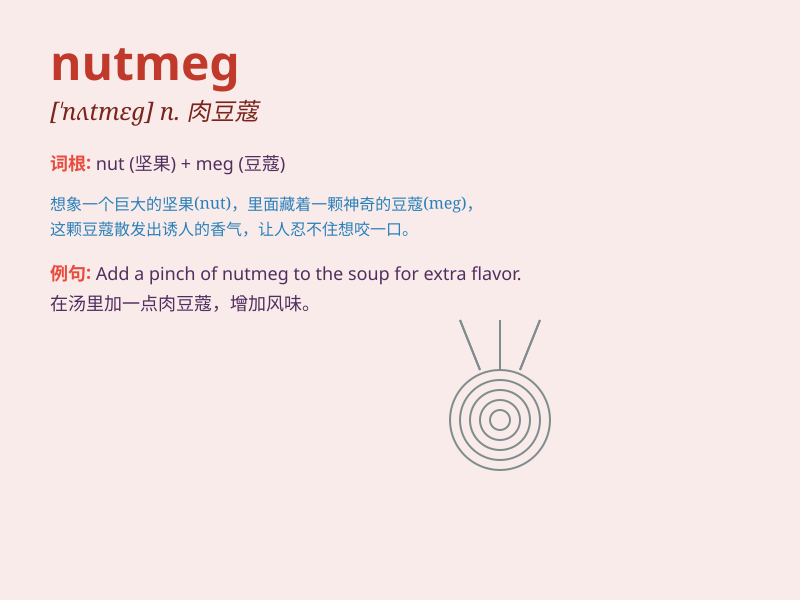

## nutmeg

**英音:** _[\'nʌtmeg]_ **美音:** _[\'nʌtmɛɡ]_

**译义:** *n.肉豆蔻,肉豆蔻种子中的核仁*

### 短语

+ **nutmeg powder:** _肉豆蔻粉_

+ **nutmeg tree:** _肉豆蔻树_

+ **ground nutmeg:** _磨碎的肉豆蔻_

+ **nutmeg oil:** _肉豆蔻油_

+ **nutmeg grater:** _肉豆蔻擦丝器_

### 例句

#### 例句1

> **She added a pinch of nutmeg to the cake batter.**

**中文翻译:** 她在蛋糕面糊中加了一小撮肉豆蔻。

**单词释义:** 肉豆蔻（一种香料）

#### 例句2

> **The smell of nutmeg filled the room.**

**中文翻译:** 房间里充满了肉豆蔻的香味。

**单词释义:** 肉豆蔻（指其本身）

#### 例句3

> **He ground some nutmeg for the recipe.**

**中文翻译:** 他磨碎了一些肉豆蔻作为食谱。

**单词释义:** 肉豆蔻（强调动作对象）

### 背诵小故事

> A little squirrel found a nutmeg in the forest. It was so precious
that it decided to hide it for the winter. But it had to remember where,
or it would lose this sweet treat. So, \'nutmeg\' became a special word
for the squirrel.

**一只小松鼠在森林里发现了一颗肉豆蔻。它太珍贵了，于是决定把它藏起来过冬。但它得记住藏在哪里，否则就会失去这个美味。所以，'nutmeg'对松鼠来说成了一个特别的词。**

### 图义

