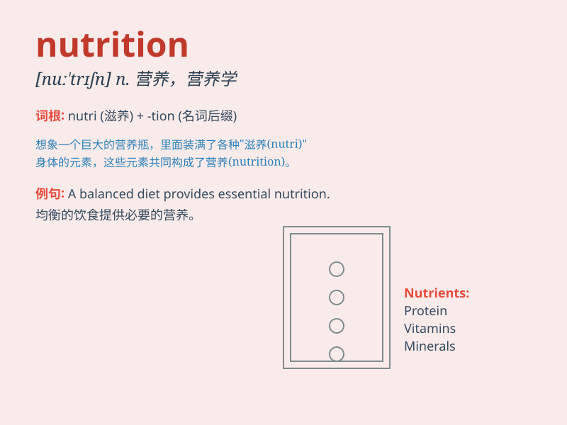

## nutrition

**英音:** _[njʊ\'trɪʃ(ə)n]_ **美音:** _[nu\'trɪʃən]_

**译义:** *n.营养,营养学*

### 短语

+ **nutrition information:** _营养信息_

+ **good nutrition:** _良好的营养_

+ **nutrition balance:** _营养平衡_

+ **nutrition expert:** _营养专家_

+ **animal nutrition:** _动物营养_

### 例句

#### 例句1

> **A balanced diet is essential for good nutrition.**

**中文翻译:** 均衡饮食对于良好的营养至关重要。

**单词释义:** 营养

#### 例句2

> **The book provides valuable information on nutrition and
health.**

**中文翻译:** 这本书提供了有关营养和健康的宝贵信息。

**单词释义:** 营养

#### 例句3

> **Poor nutrition can lead to various diseases.**

**中文翻译:** 营养不良会导致各种疾病。

**单词释义:** 营养

### 背诵小故事

> Once upon a time, a little bear was weak. A wise owl told him to pay
attention to \'nutrition\'. The bear started to eat various healthy
foods and grew strong. \'Nutrition\' means the substances we need from
food to stay healthy.

**从前，有一只小熊很虚弱。一只聪明的猫头鹰告诉他要注意"营养"。小熊开始吃各种健康的食物，变得强壮起来。"nutrition"意思是我们从食物中获取以保持健康的物质。**

### 图义

