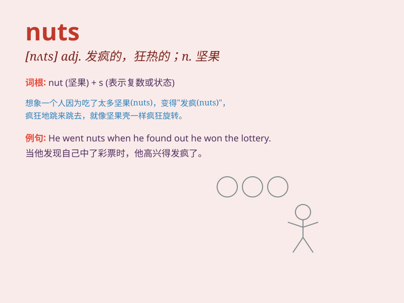

## nuts

**英音:** _[nʌts]_ **美音:** _[nʌts]_

**译义:** *adj.热衷的,发狂的int.呸,胡说*

### 短语

+ **go nuts:** _发疯；失去理智_

+ **be nuts about:** _热衷于；迷恋_

+ **nuts and bolts:** _具体细节；基本要素_

+ **drive someone nuts:** _使某人发疯；把某人逼疯_

+ **a hard nut to crack:** _棘手的问题；难以对付的人_

### 例句

#### 例句1

> **I\'m nuts about chocolate.**

**中文翻译:** 我对巧克力很着迷。

**单词释义:** 疯狂的；着迷的

#### 例句2

> **These nuts are very hard to crack.**

**中文翻译:** 这些坚果很难破解。

**单词释义:** 坚果

#### 例句3

> **He\'s gone nuts and started shouting at everyone.**

**中文翻译:** 他疯了，开始对每个人大喊大叫。

**单词释义:** 发疯的；发狂的

### 背诵小故事

> A squirrel was gathering nuts for the winter. It worked hard,
collecting as many nuts as possible. But one day, it lost its precious
stash of nuts. It went nuts looking everywhere for them!

**一只松鼠正在为冬天收集坚果。它努力工作，尽可能多地收集坚果。但有一天，它丢失了珍贵的坚果储备。它疯狂地到处寻找它们！**

### 图义

