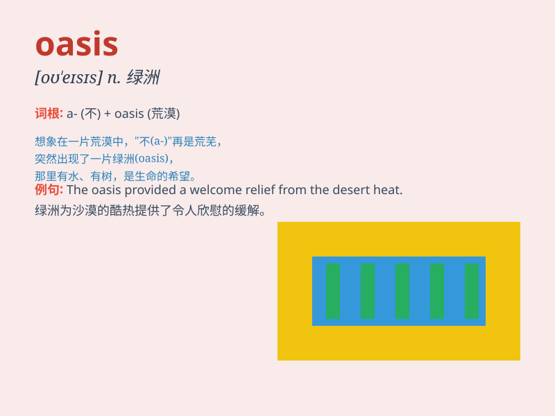

## oasis

**英音:** _[əʊ\'eɪsɪs]_ **美音:** _[o\'esɪs]_

**译义:** *n.(沙漠中)绿洲,(不毛之地中的)沃洲,舒适的地方*

### 短语

+ **oasis of calm:** _宁静的绿洲_

+ **oasis effect:** _绿洲效应_

+ **urban oasis:** _城市绿洲_

+ **oasis town:** _绿洲城镇_

+ **desert oasis:** _沙漠绿洲_

### 例句

#### 例句1

> **The oasis in the desert provided a haven for weary travelers.**

**中文翻译:** 沙漠中的绿洲为疲惫的旅人提供了避风港。

**单词释义:** 绿洲

#### 例句2

> **This park is an oasis of calm in the busy city.**

**中文翻译:** 这个公园是繁忙城市中的一片宁静绿洲。

**单词释义:** 宁静宜人的地方

#### 例句3

> **After a long day at work, my home is like an oasis of
relaxation.**

**中文翻译:** 经过一天漫长的工作后，我的家就像一片放松的绿洲。

**单词释义:** 能使人得到慰藉或放松的地方

### 背诵小故事

> A traveler was lost in the vast desert. Feeling exhausted and
thirsty, he almost gave up. Suddenly, he saw an oasis with clear water
and shady palm trees. It was like a miracle, giving him hope and saving
his life.

**一位旅行者在广袤的沙漠中迷路了。感到精疲力竭和口渴难耐，他几乎要放弃了。突然，他看到了一个有清澈的水和茂密棕榈树的绿洲。这就像一个奇迹，给了他希望并挽救了他的生命。**

### 图义

