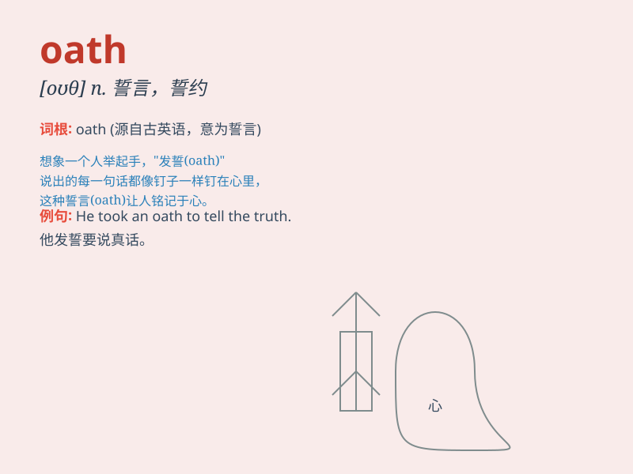

## oath

**英音:** _[əʊθ]_ **美音:** _[oθ]_

**译义:** *n.誓言,宣誓,诅咒*

### 短语

+ **swear an oath:** _发誓；立誓_

+ **take an oath:** _宣誓；发誓_

+ **under oath:** _在宣誓下；经宣誓_

+ **oath of office:** _就职宣誓_

+ **oath of allegiance:** _效忠宣誓_

### 例句

#### 例句1

> **He took an oath of allegiance to the country.**

**中文翻译:** 他宣誓效忠国家。

**单词释义:** 誓言；宣誓

#### 例句2

> **The judge reminded the witness of the oath she had taken.**

**中文翻译:** 法官提醒证人她曾宣誓。

**单词释义:** 誓言

#### 例句3

> **Under oath, she admitted stealing the money.**

**中文翻译:** 在宣誓后，她承认偷了钱。

**单词释义:** 宣誓

### 背诵小故事

> A brave knight was about to go into battle. Before leaving, he took
an oath in front of his king and comrades, vowing to protect the kingdom
with all his might. The oath was a serious promise that filled everyone
with hope and courage.

**一位勇敢的骑士即将上战场。在出发前，他在国王和战友面前立下誓言，发誓将竭尽全力保护王国。这个誓言是一个严肃的承诺，让每个人都充满了希望和勇气。**

### 图义

