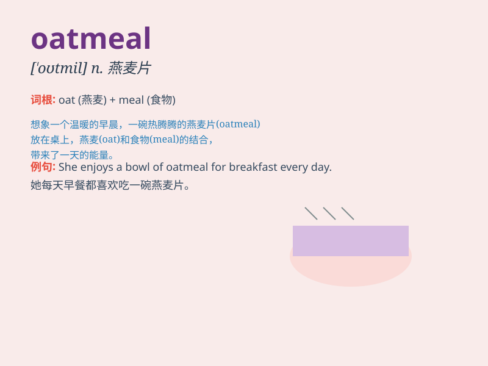

## oatmeal

**英音:** _[\'əʊtmiːl]_ **美音:** _[\'ot\'mil]_

**译义:** *n.(燕)麦片,(燕)麦粥*

### 短语

+ **oatmeal cookie:** _燕麦曲奇_

+ **oatmeal porridge:** _燕麦粥_

+ **oatmeal bath:** _燕麦浴_

+ **instant oatmeal:** _即食燕麦片_

+ **steel-cut oatmeal:** _钢切燕麦_

### 例句

#### 例句1

> **I had a bowl of oatmeal for breakfast.**

**中文翻译:** 我早餐吃了一碗燕麦片。

**单词释义:** 燕麦粥

#### 例句2

> **The oatmeal cookies are delicious.**

**中文翻译:** 燕麦饼干很好吃。

**单词释义:** 燕麦

#### 例句3

> **She mixed oatmeal with milk to make a face mask.**

**中文翻译:** 她将燕麦片与牛奶混合制成面膜。

**单词释义:** 燕麦

### 背诵小故事

> One day, a little rabbit was very hungry. Its mom prepared oatmeal
for it. The warm and nutritious oatmeal made the rabbit happy. It ate a
lot and felt full and energetic.

**有一天，一只小兔子非常饿。它的妈妈为它准备了燕麦粥。温暖又营养的燕麦粥让小兔子很开心。它吃了很多，感到饱饱的且充满活力。**

### 图义

