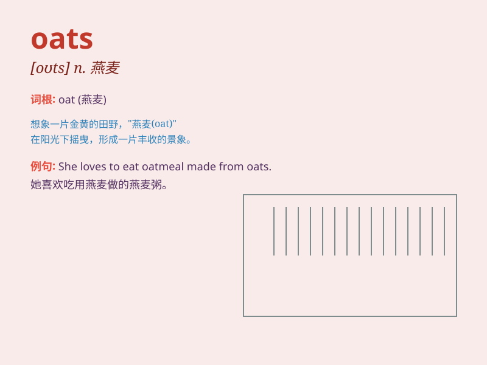

## oats

**英音:** _[əʊts]_ **美音:** _[oʊts]_

**译义:** *n.燕麦；燕麦片（常复数）；[口]废话（oat的复数形式）*

### 短语

+ **rolled oats:** _燕麦片_

+ **oat bran:** _燕麦麸_

+ **oat meal:** _燕麦粥；燕麦粉_

+ **oat grass:** _燕麦草_

+ **wild oats:** _放荡不羁；轻率之举_

### 例句

#### 例句1

> **I have a bowl of oats for breakfast every morning.**

**中文翻译:** 我每天早上早餐吃一碗燕麦。

**单词释义:** 燕麦

#### 例句2

> **The horse was fed with oats.**

**中文翻译:** 这匹马被喂了燕麦。

**单词释义:** 燕麦

#### 例句3

> **Oats are a good source of dietary fiber.**

**中文翻译:** 燕麦是膳食纤维的良好来源。

**单词释义:** 燕麦

### 背诵小故事

> One day, a little rabbit was very hungry. It found a barn full of
oats. The oats looked so delicious. The rabbit ate them happily and felt
full and strong. So, oats became its favorite food.

**一天，一只小兔子非常饿。它发现了一个装满燕麦的谷仓。燕麦看起来十分美味。小兔子开心地吃了起来，感觉又饱又有力气。所以，燕麦成了它最爱的食物。**

### 图义

