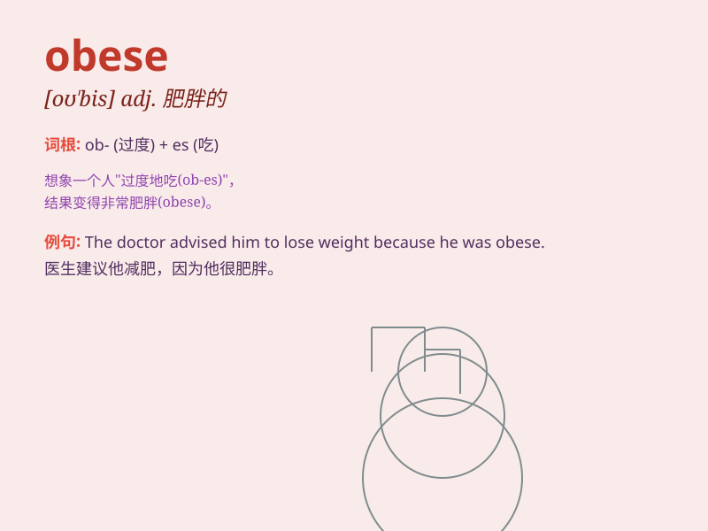

## obese

**英音:** _[ə(ʊ)\'biːs]_ **美音:** _[o\'bis]_

**译义:** *adj.肥胖的,肥大的*

### 短语

+ **obese children:** _肥胖儿童_

+ **obese patient:** _肥胖病人_

+ **severely obese:** _重度肥胖_

+ **clinically obese:** _临床肥胖_

+ **obese population:** _肥胖人群_

### 例句

#### 例句1

> **The doctor warned that she was obese and needed to lose
weight.**

**中文翻译:** 医生警告她肥胖，需要减肥。

**单词释义:** 肥胖的

#### 例句2

> **Obese people are at higher risk of developing heart disease.**

**中文翻译:** 肥胖者患心脏病的风险较高。

**单词释义:** 肥胖的

#### 例句3

> **He became obese due to his unhealthy eating habits and lack of
exercise.**

**中文翻译:** 由于不健康的饮食习惯和缺乏运动，他变得肥胖。

**单词释义:** 肥胖的

### 背诵小故事

> Once upon a time, there was an elephant named Obi. Obi loved to eat a
lot and became very fat. People called him \'obese Obi\'. From then on,
whenever I see the word \'obese\', I remember fat Obi.

**从前，有一只叫奥比的大象。奥比特别爱吃，变得非常胖。人们叫他'肥胖的奥比'。从那以后，每当我看到'obese'这个单词，就会想起胖奥比。**

### 图义

