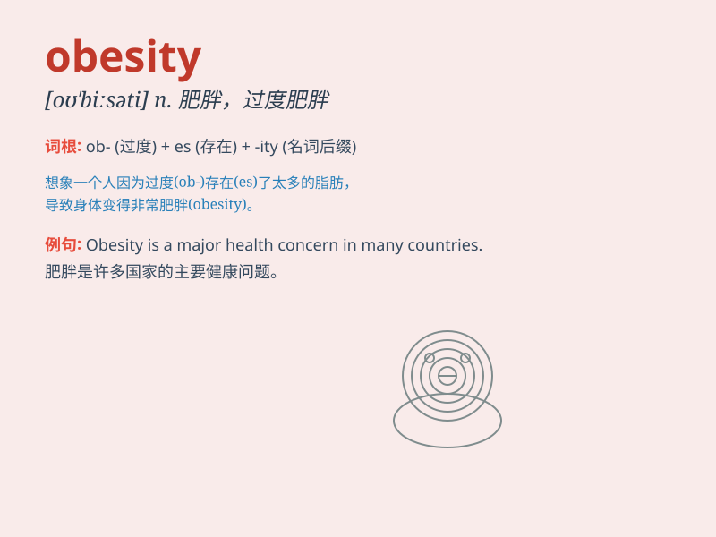

## obesity

**英音:** _[ə(ʊ)\'biːsɪtɪ]_ **美音:** _[o\'bisəti]_

**译义:** *n.肥胖,肥大*

### 短语

+ **childhood obesity:** _儿童肥胖症_

+ **obesity problem:** _肥胖问题_

+ **obesity epidemic:** _肥胖症流行_

+ **severe obesity:** _严重肥胖_

+ **obesity prevention:** _肥胖预防_

### 例句

#### 例句1

> **Obesity is a major health concern in many countries.**

**中文翻译:** 肥胖是许多国家的主要健康问题。

**单词释义:** 肥胖

#### 例句2

> **The doctor warned him about the dangers of obesity.**

**中文翻译:** 医生警告他肥胖的危险。

**单词释义:** 肥胖

#### 例句3

> **Obesity can lead to various chronic diseases.**

**中文翻译:** 肥胖可导致多种慢性疾病。

**单词释义:** 肥胖

### 背诵小故事

> Once upon a time, there was a king. His excessive eating and lack of
exercise led to a serious problem - obesity. People around him were
worried. Finally, the king realized his mistake and changed his
lifestyle.

**从前，有一个国王。他过度饮食且缺乏锻炼，导致了一个严重的问题------肥胖。他周围的人都很担心。最后，国王意识到了自己的错误并改变了生活方式。**

### 图义

