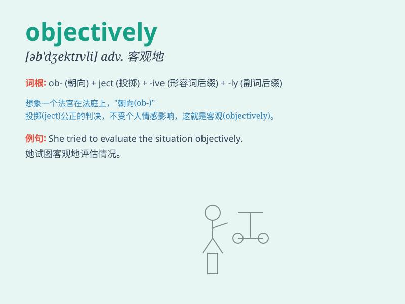

## objectively

**英音:** _[əb\'dʒektɪvlɪ]_ **美音:** _[əbˈdʒɛktɪvlɪ]_

**译义:** *adv.客观地*

### 短语

+ **objectively speaking:** _客观地说_

+ **judge objectively:** _客观地判断_

+ **analyze objectively:** _客观地分析_

+ **evaluate objectively:** _客观地评估_

+ **describe objectively:** _客观地描述_

### 例句

#### 例句1

> **We need to analyze the problem objectively.**

**中文翻译:** 我们需要客观地分析问题。

**单词释义:** 客观地

#### 例句2

> **The judge must decide objectively in the case.**

**中文翻译:** 法官必须客观地对案件作出裁决。

**单词释义:** 客观地

#### 例句3

> **She evaluates her performance objectively to improve.**

**中文翻译:** 她客观地评估自己的表现，以求改进。

**单词释义:** 客观地

### 背诵小故事

> A scientist was observing a phenomenon objectively. He ignored his
own biases and focused only on the facts. By doing so, he could make
accurate conclusions. Remember, \'objectively\' means without bias or
prejudice.

**一位科学家在客观地观察一种现象。他忽略自己的偏见，只关注事实。通过这样做，他能够得出准确的结论。记住，\'objectively\'意思是客观地，无偏见地。**

### 图义

