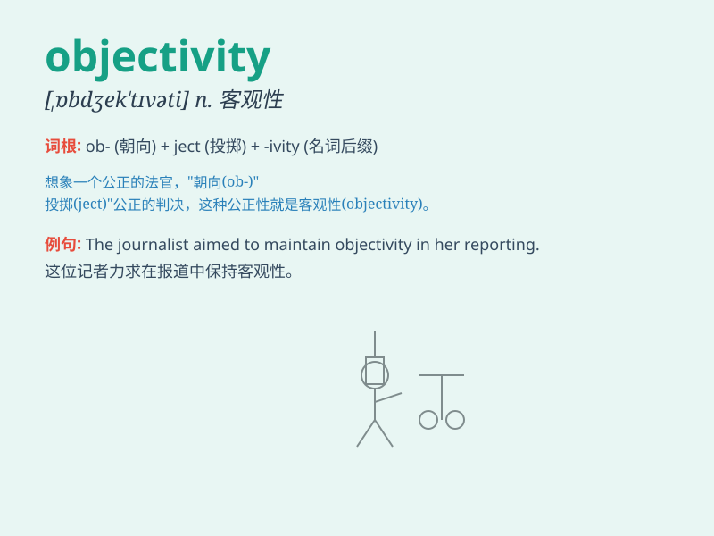

## objectivity

**英音:** _[,ɒbdʒek\'tɪvɪtɪ; ,ɒbdʒɪk\'tɪvɪtɪ]_ **美音:**
_[,ɑbdʒɛk\'tɪvəti]_

**译义:** *n.客观性,客观现实*

### 短语

+ **maintain objectivity:** _保持客观性_

+ **lack objectivity:** _缺乏客观性_

+ **achieve objectivity:** _达到客观性_

+ **preserve objectivity:** _维护客观性_

+ **compromise objectivity:** _损害客观性_

### 例句

#### 例句1

> **The scientist maintained objectivity throughout the research
process.**

**中文翻译:** 科学家在整个研究过程中保持客观性。

**单词释义:** 客观性

#### 例句2

> **Journalistic objectivity is crucial in reporting the news.**

**中文翻译:** 新闻客观性对于报道新闻至关重要。

**单词释义:** 客观性

#### 例句3

> **We need to approach this problem with objectivity and avoid
personal biases.**

**中文翻译:** 我们需要客观地处理这个问题，避免个人偏见。

**单词释义:** 客观性

### 背诵小故事

> A scientist always strives for objectivity. Once, in a research
project, everyone had different opinions. But the scientist relied on
facts and data, not personal feelings, to reach an objective conclusion.
This showed the true meaning of objectivity - being impartial and based
on facts.

**一位科学家总是努力追求客观性。有一次，在一个研究项目中，每个人都有不同的意见。但这位科学家依靠事实和数据，而非个人情感，得出了客观的结论。这展现了客观性的真正含义------公正且基于事实。**

### 图义

