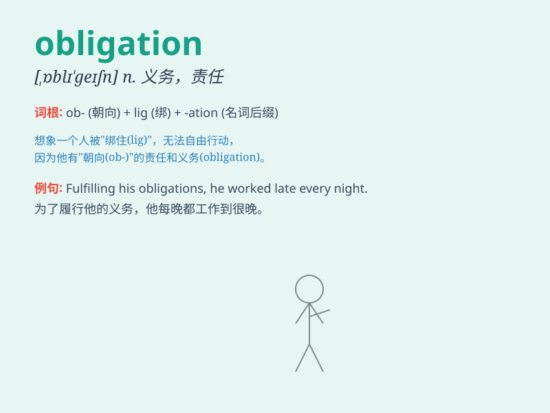

## obligation

**英音:** _[ɒblɪ\'geɪʃ(ə)n]_ **美音:** _[,ɑblɪ\'ɡeʃən]_

**译义:** *n.义务,职责,债务*

### 短语

+ **fulfill an obligation:** _履行义务_

+ **legal obligation:** _法律义务_

+ **moral obligation:** _道德义务_

+ **undertake an obligation:** _承担义务_

+ **be under an obligation:** _有义务_

### 例句

#### 例句1

> **I have an obligation to take care of my parents when they are
old.**

**中文翻译:** 当父母年老时，我有义务照顾他们。

**单词释义:** 义务；责任

#### 例句2

> **The company has an obligation to provide a safe working
environment for its employees.**

**中文翻译:** 公司有义务为员工提供安全的工作环境。

**单词释义:** 义务；责任

#### 例句3

> **Fulfilling your obligations is very important in life.**

**中文翻译:** 履行自己的义务在生活中非常重要。

**单词释义:** 义务；职责

### 背诵小故事

> A poor student needed money for tuition. A kind man gave him a loan
but with the obligation that he must repay after graduation. The student
worked hard and fulfilled the obligation.

**一个贫困的学生需要钱交学费。一位好心人借给他钱，但要求他毕业后必须偿还。这个学生努力工作并履行了义务。**

### 图义

