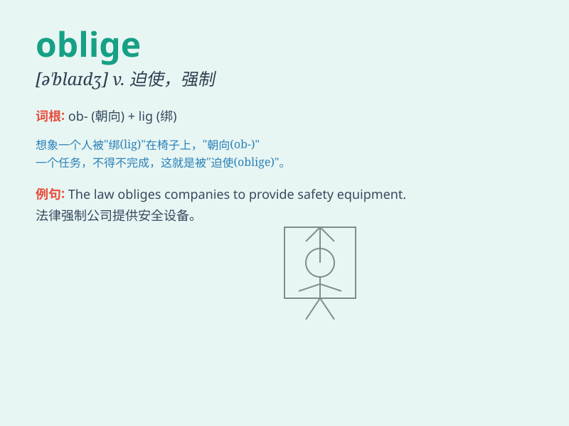

## oblige

**英音:** _[ə\'blaɪdʒ]_ **美音:** _[ə\'blaɪdʒ]_

**译义:** *vt.迫使,责成*

### 短语

+ **be obliged to:** _不得不；有义务；感谢_

+ **oblige sb. to do sth.:** _迫使某人做某事_

+ **feel obliged:** _觉得有义务_

+ **oblige with:** _帮忙；给......提供_

+ **much obliged:** _非常感谢_

### 例句

#### 例句1

> **I\'m much obliged to you for your help.**

**中文翻译:** 我非常感谢你的帮助。

**单词释义:** 感激

#### 例句2

> **The law obliges parents to send their children to school.**

**中文翻译:** 法律规定父母有义务送孩子上学。

**单词释义:** 迫使；责成

#### 例句3

> **Could you oblige me by opening the window?**

**中文翻译:** 你能帮我打开窗户吗？

**单词释义:** 帮忙；效劳

### 背诵小故事

> One day, I was in a difficult situation. A kind stranger obliged by
helping me. It made me feel grateful. \'Oblige\' means to do something
for someone because it is a favor or duty.

**有一天，我处于困境中。一位善良的陌生人帮忙，这让我很感激。'oblige'意思是因为帮忙或职责为某人做某事。**

### 图义

