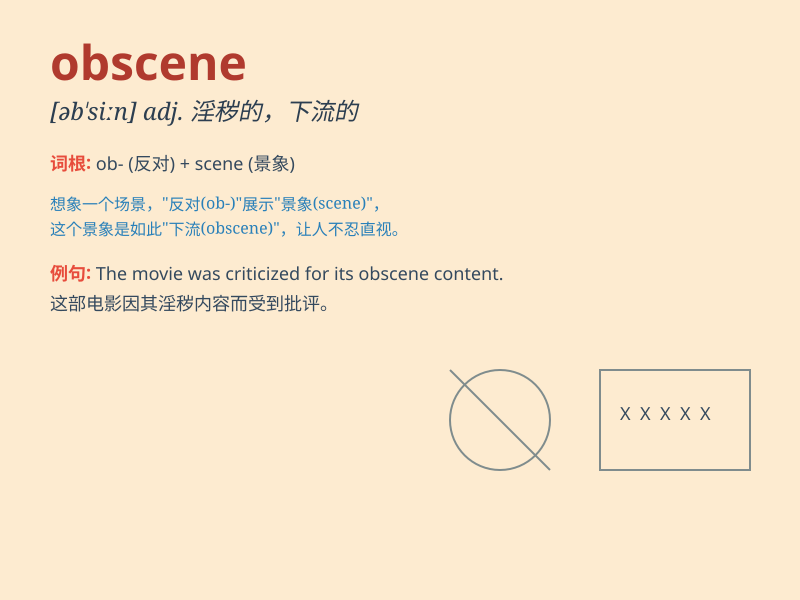

## obscene

**英音:** _[əb\'siːn]_ **美音:** _[əb\'sin]_

**译义:** *adj.淫秽的,猥亵的*

### 短语

+ **obscene language:** _淫秽的语言_

+ **obscene publication:** _淫秽出版物_

+ **obscene gesture:** _下流的手势_

+ **obscene profits:** _暴利_

+ **obscene material:** _淫秽物品_

### 例句

#### 例句1

> **The film was filled with obscene language and violence.**

**中文翻译:** 这部电影充满了猥亵语言和暴力。

**单词释义:** 淫秽的；下流的

#### 例句2

> **He made obscene gestures at the passing cars.**

**中文翻译:** 他对过往的车辆做出猥亵的手势。

**单词释义:** 下流的；猥亵的

#### 例句3

> **The obscene phone call disturbed her greatly.**

**中文翻译:** 淫秽的电话让她很不安。

**单词释义:** 淫秽的；色情的

### 背诵小故事

> A man was walking in the park and saw a group of people showing
obscene pictures. He was shocked and immediately called the police. The
police came and punished those who did the bad thing.

**一个男人在公园散步，看到一群人展示淫秽的图片。他很震惊，立即报了警。警察赶来并惩罚了那些做坏事的人。**

### 图义

