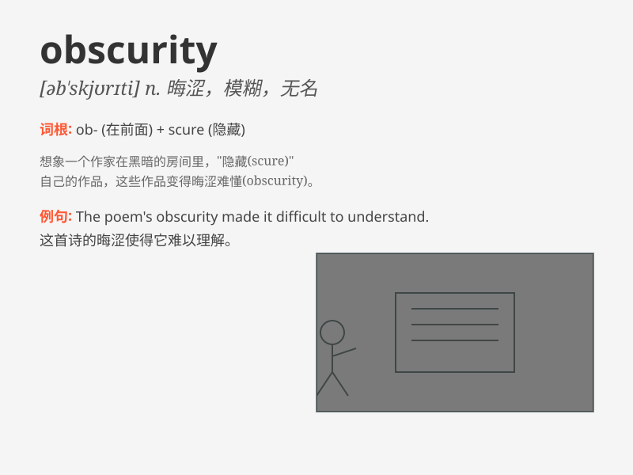

## obscurity

**英音:** _[əb\'skjʊərɪtɪ]_ **美音:** _[əb\'skjʊrəti]_

**译义:** *n.阴暗,朦胧,偏僻,含糊,隐匿,晦涩,身份低微*

### 短语

+ **fall into obscurity:** _变得默默无闻_

+ **rise from obscurity:** _从默默无闻中崛起_

+ **live in obscurity:** _过着默默无闻的生活_

+ **plunge into obscurity:** _陷入默默无闻的状态_

+ **remain in obscurity:** _一直默默无闻_

### 例句

#### 例句1

> **The author spent years in obscurity before achieving fame.**

**中文翻译:** 作者在成名之前曾默默无闻多年。

**单词释义:** 默默无闻；无名

#### 例句2

> **The poem was written in an obscurity of language that made it
hard to understand.**

**中文翻译:** 这首诗的语言晦涩难懂，难以理解。

**单词释义:** 晦涩；费解

#### 例句3

> **He emerged from obscurity to become a leading politician.**

**中文翻译:** 他从默默无闻成为一名重要的政治家。

**单词释义:** 默默无闻的状态

### 背诵小故事

> A young writer struggled in obscurity for years, his works unknown.
But one day, a chance encounter with a famous publisher brought his
talent to light. Now, he\'s no longer in the shadows of obscurity.

**一位年轻的作家多年来一直在默默无闻中挣扎，他的作品无人知晓。但有一天，一次与著名出版商的偶然相遇使他的才华得以展现。现在，他不再处于默默无闻的阴影之中。**

### 图义

