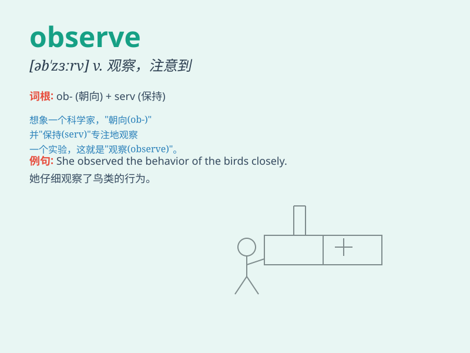

## observe

**英音:** _[əb\'zɜːv]_ **美音:** _[əb\'zɝv]_

**译义:** *vt.观察,观测,遵守,评述,说*

### 短语

+ **observe carefully:** _仔细观察_

+ **observe the rules:** _遵守规则_

+ **observe a festival:** _庆祝节日_

+ **observe silence:** _保持沉默_

+ **observe a tradition:** _遵循传统_

### 例句

#### 例句1

> **I observed her behavior carefully.**

**中文翻译:** 我仔细观察她的行为。

**单词释义:** 观察

#### 例句2

> **Please observe the speed limit when driving.**

**中文翻译:** 驾驶时请遵守限速规定。

**单词释义:** 遵守

#### 例句3

> **The scientist observed a new phenomenon.**

**中文翻译:** 科学家观察到一个新现象。

**单词释义:** 观察

### 背诵小故事

> One day, I was walking in the park and observed a beautiful bird. It
had colorful feathers. I quietly watched it and noted every detail.
That\'s how I remember the word \'observe\' which means to watch
carefully and notice something.

**有一天，我在公园散步，观察到一只漂亮的鸟。它有着五彩的羽毛。我静静地看着它，并留意每一个细节。这就是我记住'observe'这个词的方式，它意味着仔细观看并留意某事。**

### 图义

