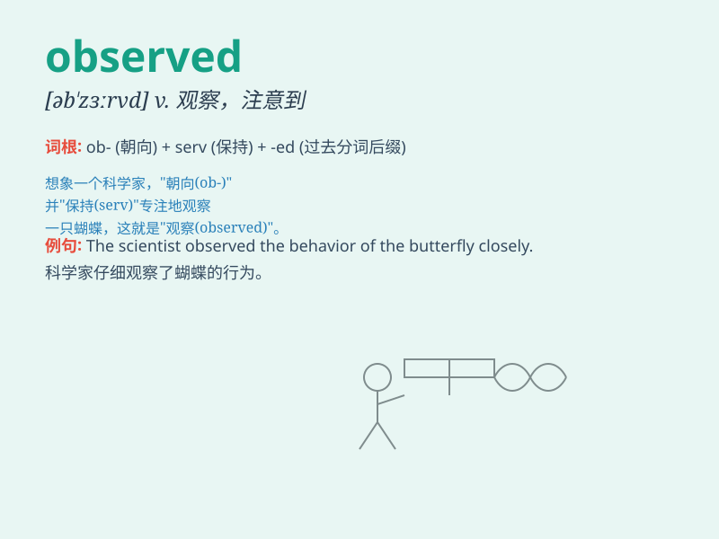

## observed

**英音:** _[əb\'zɜːvd]_ **美音:** _[əb\'zɜːrvd]_

**译义:** *v.观察,注意到,评论,说,庆祝(节日等);
adj.被观察的,遵守的*

### 短语

+ **observed behavior:** _观察到的行为_

+ **closely observed:** _密切观察_

+ **observed phenomenon:** _观察到的现象_

+ **carefully observed:** _仔细观察_

+ **observed changes:** _观察到的变化_

### 例句

#### 例句1

> **The scientist observed the behavior of the monkeys for
months.**

**中文翻译:** 这位科学家观察猴子的行为长达数月。

**单词释义:** 观察

#### 例句2

> **She observed that he seemed very tired.**

**中文翻译:** 她注意到他似乎非常疲倦。

**单词释义:** 注意到

#### 例句3

> **The customs officer observed the passengers carefully.**

**中文翻译:** 海关官员仔细观察乘客。

**单词释义:** 观察

### 背诵小故事

> One day, a scientist was in the forest and observed a rare bird. He
was very careful not to disturb it. Through his patient observation, he
discovered many interesting things about the bird.

**一天，一位科学家在森林里观察到了一只罕见的鸟。他非常小心不打扰它。通过他耐心的观察，他发现了关于这只鸟的许多有趣的事情。**

### 图义

