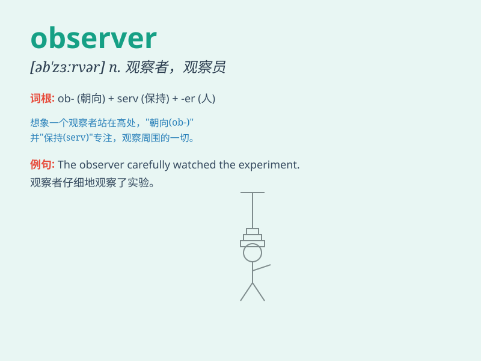

## observer

**英音:** _[əb\'zɜːvə]_ **美音:** _[əb\'zɝvɚ]_

**译义:** *n.观测者,观察员,遵守者*

### 短语

+ **observer status:** _观察员身份_

+ **careful observer:** _细心的观察者_

+ **keen observer:** _敏锐的观察者_

+ **passive observer:** _被动的观察者_

+ **trained observer:** _训练有素的观察者_

### 例句

#### 例句1

> **The observer noted the changes in the experiment carefully.**

**中文翻译:** 观察者仔细记录实验中的变化。

**单词释义:** 观察者

#### 例句2

> **She is a keen observer of human behavior.**

**中文翻译:** 她是人类行为的敏锐观察者。

**单词释义:** 观察者

#### 例句3

> **The political observer predicted the outcome of the election.**

**中文翻译:** 政治观察家预测了选举结果。

**单词释义:** 观察家

### 背诵小故事

> One day, Tom was standing in a crowded square. He noticed a
mysterious person who was silently observing everything around. This
person was like an observer, carefully noting every detail. Later, Tom
realized the importance of being an observer to understand the world
better.

**有一天，汤姆站在一个拥挤的广场上。他注意到一个神秘的人，这个人默默地观察着周围的一切。这个人就像一个观察者，仔细地记录着每一个细节。后来，汤姆意识到成为一个观察者对于更好地理解世界的重要性。**

### 图义

